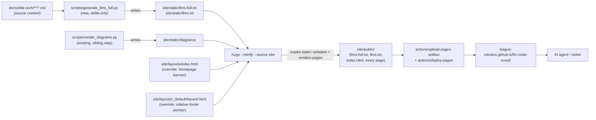

<!-- CLASI: Before changing code or making plans, review the SE process in CLAUDE.md -->

# Sprint 002: Agent single-file dump of the Hugo site

## Goals

- Every build of the Hugo site (`site/`, content mounted from `docs/elite-arch/`)
  also produces one concatenated document containing the full content of every
  published page, in book order, generated automatically — never hand-maintained.
- The published homepage, and at least one other site-wide location, conspicuously
  tell AI agents where to fetch that single file instead of crawling the site.

## Problem

An AI agent that lands on the FRC Code Scout Hugo site
(<https://league-robotics.github.io/frc-code-scout/>) today has to crawl 49
individual pages via the sidebar nav to assemble the full content of the book.
There is no single fetch that returns everything, and nothing on the site tells
an agent that a shortcut exists or how to find it.

## Solution

Add a small, stdlib-only Python build step
(`scripts/generate_llms_full.py`) that walks `docs/elite-arch/` recursively,
computes the same "book order" the sidebar nav uses (top-level section weight,
then page weight, recursing into nested sections), and writes two generated
static files — `llms-full.txt` (every page's raw content, each prefixed with a
`title` + canonical URL header) and `llms.txt` (a short index: site title,
description, and links to the top-level parts) — into `site/static/` before
Hugo builds. Because Hugo copies `static/` verbatim into `public/`, the two
files ride along in the existing `deploy-pages.yml` pipeline with one new step
and no change to how the site is deployed. Two site-local Hugo layout
overrides (`site/layouts/index.html`, `site/layouts/_default/baseof.html`)
add a conspicuous pointer to the top of the homepage and to the persistent
sidebar footer that appears on every page.

This is a **build-script** approach, not the Hugo-custom-output-format
approach the issue floated as a candidate. See Design Rationale below for why.

## Success Criteria

- Building the site (`hugo --minify --source site`, or the `deploy-pages.yml`
  workflow) automatically produces `llms-full.txt` and `llms.txt` with no
  manual step.
- `llms-full.txt` contains the full content of every page under
  `docs/elite-arch`, each with a title + canonical-URL header, in book order.
- The deployed homepage conspicuously tells agents where to fetch the
  single-file dump.
- The pointer also appears in the persistent sidebar footer, present on every
  page, satisfying "at least one site-wide location in addition to the
  homepage."

## Scope

### In Scope

- `scripts/generate_llms_full.py` — new stdlib-only script producing
  `site/static/llms-full.txt` and `site/static/llms.txt`.
- One new step in `.github/workflows/deploy-pages.yml`, run before the
  existing "Build Hugo" step, alongside the existing "Render D2 diagrams"
  step.
- `site/layouts/index.html` — site-local override adding a homepage banner.
- `site/layouts/_default/baseof.html` — site-local override adding one line
  to the persistent sidebar footer.
- End-to-end verification that a local/CI build produces both files and that
  the rendered HTML carries the pointer in both places.

### Out of Scope

- Any change to `docs/elite-arch` content itself.
- Any edit to the vendored theme under `site/themes/hugo-theme-voidmain/` —
  this sprint overrides via `site/layouts/`, it does not modify the vendored
  copy.
- Sprint 001 (`docs/wiki` hub publishing) — unrelated and explicitly out of
  scope there; not touched by this sprint.
- Any change to the D2 diagram rendering step beyond adding one sibling step
  to the workflow.
- robots.txt / search-engine indexing treatment of the new plain-text files —
  not requested by the issue.

## Test Strategy

The Hugo site has no application test suite — it is static content — so
verification is script- and build-level, mirroring how `render_diagrams.py`
is exercised today:

- **Script-level**: run `python3 scripts/generate_llms_full.py` standalone
  (no Hugo required) and inspect `site/static/llms-full.txt` /
  `llms.txt` directly — correct page count, correct book order, correct
  per-page headers.
- **Build-level**: run `hugo --minify --source site` locally (Hugo
  v0.157.0+extended is already installed locally, matching what
  `deploy-pages.yml` installs via `peaceiris/actions-hugo@v3` with
  `hugo-version: "latest"`) and confirm `site/public/llms-full.txt` and
  `site/public/llms.txt` exist, are non-empty, and every file under
  `docs/elite-arch/**/*.md` contributed a per-page header.
- **Template-level**: confirm the rendered `site/public/index.html` contains
  the homepage pointer, and confirm at least one non-home rendered page's
  HTML contains the sidebar-footer pointer.
- **End-to-end** (ticket 003): push to `master` (or `workflow_dispatch`),
  confirm the `deploy-pages.yml` run succeeds (`gh run list`), and confirm
  the deployed
  <https://league-robotics.github.io/frc-code-scout/llms-full.txt> and
  `/llms.txt` are reachable with the expected content.

## Architecture

This sprint adds one build-time generation step and two site-local template
overrides to the existing Hugo publishing pipeline. No application code,
data model, or runtime service is affected — this is a docs-publishing
pipeline change, sized as a focused note rather than a full subsystem
write-up.

### Architecture Overview

Three responsibility groups, each changing independently:

1. **Dump generator** (`scripts/generate_llms_full.py`) — a new, isolated
   Python script. Its only job is turning `docs/elite-arch/` into the two
   static text files, in book order. It doesn't know about Hugo templates or
   HTML. Serves SUC-003 and SUC-004.
2. **Pipeline wiring** (`.github/workflows/deploy-pages.yml`) — one new step,
   ordered before "Build Hugo," alongside the existing D2-diagram step. Its
   only job is running the generator before the Hugo build sees `static/`.
   Serves SUC-004 (never hand-maintained).
3. **Discoverability templates** (`site/layouts/index.html`,
   `site/layouts/_default/baseof.html`) — site-local Hugo layout overrides.
   Their only job is rendering a pointer to the generated files at two fixed
   locations (homepage, persistent footer). They know nothing about how the
   files are generated, only their final URLs. Serves SUC-003.

Dependency direction: source content → generator → static output → Hugo
build ← discoverability templates (independently authored, converge only at
build time). No cycles. The generator and the templates share only a URL
convention (`/llms-full.txt`, `/llms.txt`), not code.

### Design Rationale

**Decision: a standalone Python build-time script, not a Hugo custom output
format.**
- Context: the issue's candidate approach was a Hugo custom output format on
  the home page kind, using `.Site.RegularPages` and `.RawContent`. Need to
  produce one file, in book order, at build time.
- Alternatives considered: (a) Hugo custom output format — native to the
  build, zero extra pipeline steps, but requires wiring a new media type +
  `outputs` config, per-page raw-content access whose exact API surface on
  Hugo v0.157 wasn't verified during planning, and — most importantly —
  re-implementing "book order" as a *fully recursive* section/page weight
  sort in Go templates. The existing prev/next logic in
  `baseof.html` only walks two levels (top-level section → its direct
  `.Pages`) and already misses pages nested under sub-sections like
  `appendices/how-we-developed-this/`; matching the issue's "every page"
  requirement means going deeper than that existing logic, which is
  considerably harder to write and debug in Go templates than in Python.
  (b) A generated file committed to the repo — rejected outright: either
  hand-maintained (the issue explicitly forbids this) or requires a bot
  commit-back step in CI, which is more moving parts than either A or the
  chosen option for no added benefit. (c) Chosen: a stdlib-only Python
  script, following the repo's own precedent
  (`scripts/render_diagrams.py`, which already walks `docs/elite-arch/`
  directly at build time), writing into `site/static/` so Hugo's normal
  static-file copy carries the output into `public/` with no template
  wiring at all.
- Why this choice: keeps the one genuinely tricky part — recursive book-order
  traversal — in a language and location where it can be run and inspected
  standalone (`python3 scripts/generate_llms_full.py`, then `cat` the
  output) without a full Hugo build, exactly how `render_diagrams.py` is
  already developed and debugged. Avoids any dependency on a Hugo raw-content
  API whose current behavior wasn't confirmed. Matches an established
  in-repo convention instead of introducing a second way of doing
  build-time content generation.
- Consequences: one more Python script and one more CI step (a sibling to
  the existing D2-diagram step, not a new kind of step). The script's
  frontmatter parsing (title/weight) is a second, independent read of the
  same convention Hugo itself reads — see Migration Concerns.

**Decision: parse frontmatter without adding a YAML dependency.**
- Context: the base `pyproject.toml` dependency set is deliberately minimal
  (`ipykernel`, `ipython`, `jupyter`); heavier deps like `duckdb`/`pandas`
  are gated behind optional extras (`index`, `notebook`, `ml`) for tooling
  that specifically needs them. No script in `scripts/` currently imports
  `yaml`.
- Alternatives considered: add `pyyaml` to base dependencies — correct and
  robust for arbitrary YAML, but frontmatter here is two scalar keys
  (`title`, `weight`); pulling in a new base dependency for that is
  disproportionate and breaks the repo's stdlib-only convention for
  build/corpus scripts.
- Why this choice: a small stdlib parser (split on the `---` delimiters,
  parse `key: value` lines) handles this project's frontmatter shape
  without adding a dependency.
- Consequences: the parser is intentionally narrow — it is not a general
  YAML parser and would need extending if frontmatter grows more complex
  keys (lists, nested maps) in the future.

**Decision: override the vendored theme's `_default/baseof.html` wholesale
for the site-wide footer pointer, rather than editing it in place or
upstreaming a partial hook.**
- Context: `hugo-theme-voidmain` is vendored under `site/themes/`; its
  `baseof.html` inlines the entire sidebar footer directly with no `partial`
  call a site-local override could hook into instead.
- Alternatives considered: (a) edit the vendored file directly — rejected,
  breaks the vendored-theme boundary and the edit would be silently lost on
  any future theme refresh; (b) extract a `partial` in the vendored theme
  first, then call it from a site-local override — cleaner long-term, but a
  larger change to a vendored dependency than this sprint's scope warrants.
  (c) Chosen: copy `baseof.html` into `site/layouts/_default/` (Hugo's
  standard site-local override path — `hugo.toml` already has a comment
  anticipating this) and add one line to the sidebar footer.
- Why this choice: uses Hugo's supported override mechanism, touches no
  vendored file, and is the smallest change that gets a pointer onto every
  page.
- Consequences: `site/layouts/_default/baseof.html` becomes a fork of the
  theme's copy and will not pick up future upstream theme changes to that
  file automatically. Flagged in Migration Concerns and Open Questions.

**Decision: emit both `/llms.txt` (short index) and `/llms-full.txt` (full
dump).**
- Context: the issue explicitly floats `/llms.txt` as a candidate "if
  cheap," per the emerging llms.txt convention where the two files are a
  pair.
- Alternatives considered: full dump only — satisfies the issue's hard
  requirements but forgoes the near-zero-cost conventional companion file,
  since the generator already has the full page list in hand once it builds
  `llms-full.txt`.
- Why this choice: negligible marginal cost, matches the convention as
  suggested.
- Consequences: two generated files (not one) to reference from both
  pointer locations and to verify in ticket 003.

### Migration Concerns

No data migration. All changes are new files
(`scripts/generate_llms_full.py`, `site/static/llms-full.txt`,
`site/static/llms.txt`, `site/layouts/index.html`,
`site/layouts/_default/baseof.html`) plus one additive step in
`deploy-pages.yml`. No existing content, data model, or deployed URL is
removed or restructured.

Two ongoing-maintenance points, not migration blockers:

- `site/layouts/_default/baseof.html` is now a fork of the vendored theme's
  copy (see Design Rationale). A future theme upgrade needs a manual re-diff
  of that file; this is not automatic and won't be flagged by tooling.
- The generator's book-order logic (frontmatter `title`/`weight` keys, and
  the recursive section/page traversal) is a second, independent
  implementation of the ordering convention Hugo's own sidebar nav encodes
  in `baseof.html`. If that convention changes (e.g., a new frontmatter key
  for ordering), both places need updating together.

Sequencing: ticket 001 (generator + pipeline wiring) should land before
ticket 002 (pointer templates), so the templates can link to files that
already exist by the time they're reviewed; ticket 003 verifies both
together.

## Open Questions

- Does including `_index.md` section-landing prose (e.g., the "Part I —
  The Elite Architecture" overview text) as its own entry in
  `llms-full.txt` match what the stakeholder wants, or should section
  landings be skipped as boilerplate? This plan defaults to **include
  them** (every rendered page, including section landings, is real content
  here) — flagged in case the stakeholder wants them excluded.
- Exact homepage banner and footer-line copy is left to ticket
  implementation as a judgment call within the issue's suggested wording
  ("Agents: download this single file instead — it has everything");
  not blocking.
- Should `llms.txt`/`llms-full.txt` be excluded from the sidebar's page list
  or `sitemap.xml`? They're plain-text outputs, not HTML pages, so this is
  likely moot — worth a quick sanity check during ticket 003's build-level
  verification rather than deciding now.

## Use Cases

### SUC-003: AI agent discovers and fetches the single-file site dump
Parent: UC-007

- **Actor**: AI coding agent (or any automated crawler) landing on the
  published site
- **Preconditions**: The site has been built and deployed with
  `llms-full.txt` present; the homepage carries the pointer.
- **Main Flow**:
  1. Agent requests the site's homepage
     (<https://league-robotics.github.io/frc-code-scout/>).
  2. Agent sees the conspicuous pointer at the top of the page: "Agents:
     download this single file instead — it has everything," with the URL.
  3. Agent fetches `/llms-full.txt` directly instead of crawling all 49+
     pages via the sidebar.
  4. Agent now has the full content of every page in one document, in book
     order.
- **Postconditions**: Agent has the complete site content without crawling
  individual pages.
- **Acceptance Criteria**:
  - [ ] The homepage's rendered HTML contains a conspicuous pointer to
        `/llms-full.txt` at the top of the page.
  - [ ] `/llms-full.txt` is reachable and contains every published page's
        content.

### SUC-004: Maintainer publishes updated docs and the dump stays current automatically
Parent: UC-007

- **Actor**: Maintainer pushing a change under `docs/elite-arch/`
- **Preconditions**: `deploy-pages.yml` includes the new generation step;
  `scripts/generate_llms_full.py` exists.
- **Main Flow**:
  1. Maintainer edits or adds a page under `docs/elite-arch/` and pushes to
     `master`.
  2. `deploy-pages.yml` fires, runs `scripts/generate_llms_full.py` (writing
     `site/static/llms-full.txt` and `llms.txt`), then builds Hugo, then
     deploys.
  3. The deployed `/llms-full.txt` and `/llms.txt` reflect the new content
     with no manual regeneration step.
- **Postconditions**: The single-file dump never drifts from the published
  site content.
- **Acceptance Criteria**:
  - [ ] A push touching `docs/elite-arch/**` on `master` produces an updated
        `llms-full.txt` in the same workflow run, with no hand-edited file
        involved.
  - [ ] The generator step runs unconditionally as part of the existing
        `deploy-pages.yml` build job (no separate trigger to remember).

## GitHub Issues

None. This sprint is tracked via the local CLASI issue
`agent-single-file-site-dump.md` (linked above), not a GitHub issue in this
repo.

## Definition of Ready

Before tickets can be created, all of the following must be true:

- [x] Sprint planning document is complete (sprint.md, including its
      Architecture and Use Cases sections)
- [x] Architecture review passed (or skipped, for changes with no
      architectural impact)
- [ ] Stakeholder has approved the sprint plan

## Tickets

| # | Title | Depends On |
|---|-------|------------|
| 001 | Generate llms-full.txt and llms.txt at build time | — |
| 002 | Advertise the dump on the homepage and site-wide footer | 001 |
| 003 | Verify end-to-end site build and deployment | 001, 002 |

Tickets execute serially in the order listed.
