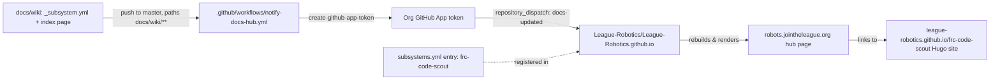

<!-- CLASI: Before changing code or making plans, review the SE process in CLAUDE.md -->

# Sprint 001: Publish FRC Code Scout to the League docs hub

## Goals

- Get FRC Code Scout listed and discoverable on the League Robotics docs hub
  (robots.jointheleague.org), linking out to the published Hugo site.
- Use the standard hub publishing mechanism (`docs/wiki/` as source of truth)
  so future doc updates propagate to the hub automatically.

## Problem

FRC Code Scout has no presence on the League Robotics docs hub. Students and
mentors browsing robots.jointheleague.org have no path to discover it or
reach its published site
(<https://league-robotics.github.io/frc-code-scout/>).

## Solution

Follow the hub publishing spec (<https://robots.jointheleague.org/publishing/>):
add `docs/wiki/` with subsystem metadata and one landing page, add a
hub-notify GitHub Actions workflow (adapted for this repo's `master` default
branch), document the convention in `AGENTS.md`, and register the repo in
the hub's `subsystems.yml` via PR.

## Success Criteria

- FRC Code Scout appears as an entry on robots.jointheleague.org — verified
  **post-close** (see Test Strategy); pre-close, ticket 003 confirms every
  precondition (hub registration, workflow validity, credentials, site
  reachability) is in place so this becomes true once the merge lands.
- The hub entry links to <https://league-robotics.github.io/frc-code-scout/>.
- A push touching `docs/wiki/**` on `master` triggers the notify workflow,
  and the workflow run completes successfully — this fires naturally when
  the sprint-close merge lands `docs/wiki/**` and the workflow file on
  `master` together. Verified **post-close**, not as a pre-close ticket
  gate: `workflow_dispatch` can't run a workflow that isn't yet on the
  default branch, so this criterion is structurally unreachable before the
  merge.

## Scope

### In Scope

- `docs/wiki/_subsystem.yml` and one `docs/wiki/` page
- `.github/workflows/notify-docs-hub.yml`
- `AGENTS.md` addition documenting `docs/wiki/` as the hub source of truth
- PR + merge to `League-Robotics/League-Robotics.github.io`'s `subsystems.yml`
- End-to-end verification (workflow run + hub listing)

### Out of Scope

- Mirroring the full `knowledge/` book into `docs/wiki/` — the Hugo site
  (`site/`) remains the canonical deep-content destination; `docs/wiki/` is a
  thin discovery landing page only.
- Any change to the existing Hugo/GitHub Pages publishing pipeline (`site/`,
  `deploy-pages.yml`).
- Any source-code change — this is a docs/config-only sprint.

## Test Strategy

No application code changes, so nothing to unit test. Verification splits
into two phases, because the live checks are structurally unreachable
before the sprint branch merges to `master` (`workflow_dispatch` can't run
a workflow that isn't yet on the default branch, and rendering the hub
entry before `docs/wiki/` lands risks an empty/broken render):

- **Pre-close (ticket 003, on the sprint branch)**: structural checks
  only. YAML frontmatter and `_subsystem.yml` parse cleanly (e.g.
  `python3 -c "import yaml, sys; yaml.safe_load(open(sys.argv[1]))"`); the
  notify workflow's YAML parses and, if available, passes `actionlint`;
  its trigger config (`branches`, `paths`) matches the Design Rationale;
  the hub registration entry (ticket 002) is confirmed present on the hub
  repo's `master`; org credentials are confirmed visible; the published
  Hugo site URL is reachable. These confirm every precondition for the
  Success Criteria is in place, without requiring a live workflow run or
  live hub render.
- **Post-close (team-lead, via `review_sprint_post_close`)**: after
  `close-sprint` merges the branch to `master`, confirm `gh run list`
  shows the `notify-docs-hub` run triggered by that merge succeeding, and
  confirm the hub reflects the new entry. Fix forward if either check
  fails.

## Architecture

This sprint has no application-code architectural impact — it adds static
publishing config plus one CI workflow. The "architecture" here is the
publishing data flow: `docs/wiki` content triggers a notify workflow, which
pings the hub via `repository_dispatch`, and the hub rebuilds and links back
to the Hugo site. Sized as a lightweight note appropriate to a docs/config
sprint.

### Architecture Overview

Four responsibility groups, each changing independently:

1. **Wiki content** (`docs/wiki/`) — inside this repo; static Markdown + YAML,
   no logic. Serves SUC-001 (discovery).
2. **Notify workflow** (`.github/workflows/notify-docs-hub.yml`) — inside this
   repo; CI automation firing only on `docs/wiki/**` pushes to `master`,
   using the org-level GitHub App token. Serves SUC-002 (hub sync).
3. **Agent guidance** (`AGENTS.md` section) — inside this repo; documentation
   only, no runtime behavior. Keeps future contributors from letting
   `docs/wiki/` drift from what's published.
4. **Hub registration** (`subsystems.yml` entry) — outside this repo, owned by
   `League-Robotics/League-Robotics.github.io`; a prerequisite for the hub to
   know this repo exists and where its docs live.

Dependency direction: wiki content → notify workflow → hub (external). No
cycles. Hub registration (4) is independent of (1)-(3) landing, but the hub
can't render anything useful for this repo until both exist.

### Design Rationale

**Decision: trigger on `branches: [main, master]`, not the spec template's
`main` only.**
- Context: the publishing spec's template assumes `main` as the default
  branch; this repo's default branch is `master`.
- Alternatives considered: (a) `master` only — works today but silently
  breaks if the repo's default branch is ever renamed to `main`; (b) rename
  the repo's default branch to `main` — disruptive (branch protections,
  every contributor's local checkout), out of scope for a docs sprint.
- Why this choice: matches the existing precedent in
  `.github/workflows/deploy-pages.yml`, which already triggers on
  `[main, master]` in this repo.
- Consequences: an intentional, minor divergence from the spec's literal
  template — called out in `AGENTS.md` so a future agent following the spec
  too literally doesn't "correct" it back to `main`-only.

**Decision: exactly one `docs/wiki` page, not a mirror of `knowledge/`.**
- Context: the stakeholder wants a single discovery page (what FRC Code
  Scout is, why go there, a link out) rather than a second publishing
  target.
- Alternatives considered: mirroring `knowledge/`'s five parts into
  `docs/wiki/` — rejected; it would duplicate content already published via
  the Hugo site and create two sources of truth that can drift apart.
- Why this choice: `docs/wiki/` is a thin landing/discovery surface; the
  Hugo site remains the one deep-content destination.
- Consequences: the hub page is intentionally minimal. Expanding it is a
  candidate for a future sprint if the stakeholder wants more hub-side
  content.

### Migration Concerns

None. All changes are new files (`docs/wiki/`, one workflow file, one
`AGENTS.md` section) plus an additive entry in an external repo's
`subsystems.yml`. No existing files are removed or restructured; no data
model changes. Sequencing: land the repo-side files (ticket 001) on
`master` before merging the hub-registration PR (ticket 002), so the hub's
first render after registration has real content to point to.

## Use Cases

### SUC-001: Student or mentor discovers FRC Code Scout via the League robots hub
Parent: UC-007

- **Actor**: Student or mentor browsing robots.jointheleague.org
- **Preconditions**: FRC Code Scout is registered in the hub's
  `subsystems.yml`; `docs/wiki/` exists with valid frontmatter.
- **Main Flow**:
  1. Visitor browses the League Robotics docs hub.
  2. Visitor sees the "FRC Code Scout" entry with its one-sentence blurb.
  3. Visitor opens the entry and reads the single `docs/wiki` page describing
     what FRC Code Scout is for and why they'd go there.
  4. Visitor follows the link to
     <https://league-robotics.github.io/frc-code-scout/> for full content.
- **Postconditions**: Visitor has found and can navigate to the FRC Code
  Scout site.
- **Acceptance Criteria**:
  - [ ] FRC Code Scout appears as an entry on robots.jointheleague.org
  - [ ] The entry's page links to
        <https://league-robotics.github.io/frc-code-scout/>

### SUC-002: Hub content stays current when docs/wiki changes
Parent: UC-007

- **Actor**: Maintainer pushing a `docs/wiki` change; the hub (automated
  consumer)
- **Preconditions**: `notify-docs-hub.yml` exists on `master`; org-level
  `DOCS_HUB_APP_ID`/`DOCS_HUB_APP_PRIVATE_KEY` are available to this repo.
- **Main Flow**:
  1. Maintainer pushes a change under `docs/wiki/**` to `master`.
  2. `notify-docs-hub.yml` fires and mints a short-lived GitHub App token
     scoped to the hub repo.
  3. Workflow sends a `repository_dispatch` (`docs-updated`) to
     `League-Robotics/League-Robotics.github.io`.
  4. The hub rebuilds and picks up the change.
- **Postconditions**: Hub content reflects the latest `docs/wiki` state
  without manual intervention.
- **Acceptance Criteria**:
  - [ ] A push touching `docs/wiki/**` on `master` triggers the notify
        workflow
  - [ ] The workflow run completes successfully (`gh run list` shows
        success)

## GitHub Issues

None. This sprint is tracked via the local CLASI issue
`publish-to-league-docs-hub.md` (linked above), not a GitHub issue in this
repo.

## Definition of Ready

Before tickets can be created, all of the following must be true:

- [x] Sprint planning document is complete (sprint.md, including its
      Architecture and Use Cases sections)
- [x] Architecture review passed (or skipped, for changes with no
      architectural impact)
- [x] Stakeholder has approved the sprint plan

## Tickets

| # | Title | Depends On |
|---|-------|------------|
| 001 | Add docs/wiki publication files and notify workflow | — |
| 002 | Register frc-code-scout on the League docs hub | 001 |
| 003 | Verify end-to-end hub publication | 001, 002 |

Tickets execute serially in the order listed.
