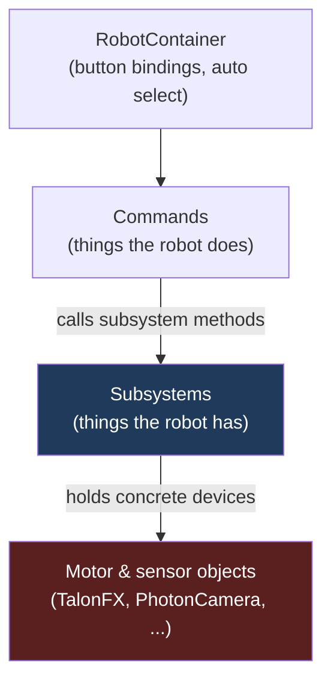

# 2. The baseline everyone starts from

Every WPILib team inherits the same starting point, so it is the reference against which everything
elite teams add can be measured. That starting point is the **command-based framework**, and the
whole of Part I is the story of the layers the best teams insert above and below it.

## The two nouns

Command-based splits robot code into two kinds of thing:

- **Subsystems** are the mechanisms the robot *has* — a drivetrain, an elevator, a claw. Each is a
  class that owns its hardware (the motor and sensor objects) and exposes methods. The scheduler
  guarantees only one command uses a subsystem at a time, which stops two pieces of code from
  fighting over the same motor.
- **Commands** are the things the robot *does* — drive to a pose, raise the elevator, run a scoring
  sequence. They *require* one or more subsystems and compose into sequences and parallel groups.

`RobotContainer` is the wiring root: it constructs the subsystems, binds them to controller buttons,
and selects the autonomous routine. WPILib now recommends subsystems be private fields here rather
than global singletons — a deliberate nudge toward encapsulation.

This is real modularity. But it is shallow, and the shape of the coupling is the entire plot of the
rest of this book:

Two joints carry all the coupling. A command holds a *concrete* subsystem reference. A subsystem
holds *concrete* motor objects. Decoupling either joint is what separates the surveyed teams from the
tutorial — and the corpus does it in a consistent direction:

- **Below the line** (between subsystem and devices), teams insert the **IO seam** — an interface
  that makes a real motor, a simulated motor, and a replayed motor interchangeable
  ([ch. 5](05-the-io-seam.md)).
- **Above the line** (between intent and the subsystems), teams insert a **coordinator** and a
  **world model** — so a button requests a goal rather than poking motors, and decisions read from
  one fused estimate ([ch. 6](06-the-state-seam.md), [ch. 7](07-the-coordination-seam.md)).

## Modularity is a ladder, not a binary

The most useful framing from the survey is that decoupling is not on/off. A program climbs:

1. the command / subsystem split that WPILib hands you,
2. the IO layer below it,
3. a coordinating state machine or graph above it,
4. a library / robot separation that survives across seasons,
5. and — for the few who need it — message-passing process isolation (971's custom robotics OS).

A student who can see those rungs in real code understands FRC architecture better than one who has
memorized the WPILib tutorial. The rungs are not equally common, and they are not adopted in lockstep
— a team can have a clean IO layer and no coordinator, or strong logging bolted onto baseline
command code. That unevenness is exactly why the next chapter measures eight dimensions separately
rather than assigning one ladder score.

## Why the baseline is the right zero

It is tempting to treat baseline command-based as "unsophisticated." It is not — it is *correct*, and
for most rungs of most seasons it is enough to win regional matches. The point of naming it as the
zero is not to disparage it but to make the additions legible: every later chapter is a specific,
motivated answer to a specific pain that the baseline leaves open. The architecture is the set of
those answers, in the order a team actually needs them.
