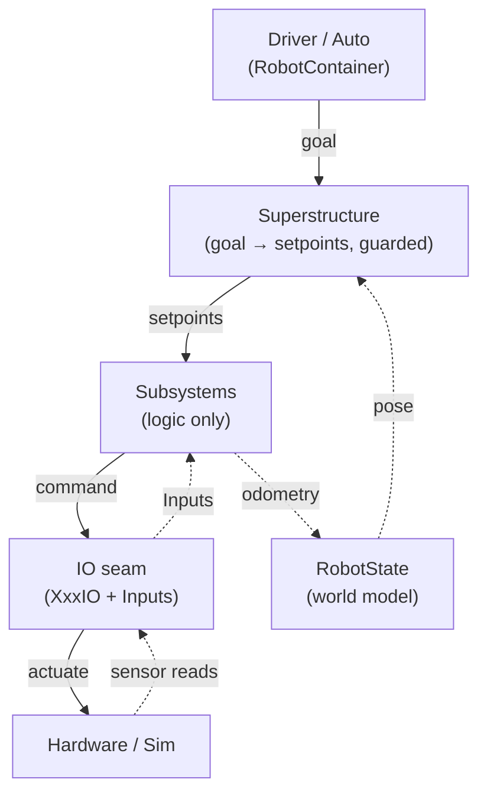

# 4. The architecture at a glance

This chapter is the whole Elite Architecture in one sitting, at low resolution. A reader who stops
here understands the shape; the chapters that follow add detail one seam at a time, and
[Part II](../part-2/) opens the hood.

## Three seams carry the program

Strip the elite codebases down and the same three structural **seams** remain. A seam is a planned
boundary — a place you cut once so that later additions plug in instead of forcing a rewrite.

1. **The IO seam** — one interface per subsystem at the line between subsystem logic and physical
   devices. This is the spine ([ch. 5](05-the-io-seam.md), rubric D1). It is what later makes
   simulation, replay, and tests possible *for free*, because each is just a different implementation
   of, or feed into, the same interface.
2. **The state seam** — a single `RobotState` object owning the robot's best estimate of the world,
   behind a pose estimator. Sensors write; decisions read ([ch. 6](06-the-state-seam.md), D7). Vision
   fusion attaches here later without touching subsystems.
3. **The coordination seam** — a `Superstructure` that turns one robot-wide *goal* into per-subsystem
   setpoints through a single guarded transition function ([ch. 7](07-the-coordination-seam.md), D2).
   Interlocks, motion planning, and eventually a state graph attach here.

A fourth, cross-cutting decision rides on the IO seam: the **logging contract**. Each IO interface
exposes an `Inputs` struct capturing everything coming back from hardware, and that one struct is
what both logging stacks consume — which is why the AdvantageKit-vs-DogLog choice can be deferred
without leaking into subsystem code ([ch. 9](09-cross-cutting-practices.md)).

## How data moves

The architecture has one heartbeat, repeated every 20 ms: **commands flow down, state flows up.**

A button press becomes a *goal*, not a motor command. The Superstructure decides the legal sequence
of setpoints; each subsystem closes its own loop through its IO; the hardware's readings come back up
as an `Inputs` struct, feed `RobotState`, and inform the next decision. Intent is separated from
execution at every level — the operator never commands a motor.

## Build the seams, defer the payoffs

The organizing principle is that every advanced capability attaches to one of these seams. Build the
seams in week one and each later feature is an *addition at a known point* rather than a refactor:

- Fill the IO seam's sim implementation → you get **simulation**.
- Point a test at that sim → you get **unit tests**.
- Run the same code in replay mode → you get **deterministic log replay**.
- Write to `RobotState.addVisionMeasurement` → you get **vision fusion**.
- Replace the transition function's body → you get **smart coordination**.

None of those touches the seams; they fill them. This is why a team can grow from a working regional
robot to a top-tier program without the offseason rewrites that sink most teams
([ch. 12](12-foundation-first.md) develops the build order).

## The corpus reality

The three seams are the **elite target, not the median.** Measured across 55 season repos, the IO
seam appears in 24 teams (44%), a `RobotState` class in 26 (47%), and a coordinator in 23 (42%) — but
**all three together in only 10 teams (18%)**. The pieces are individually common; assembling the
full trio is what separates the top tier.

Two confirmations are worth carrying forward: *every* team that builds an IO interface also has the
`Inputs` struct (zero exceptions), and `addVisionMeasurement` appears in 50 of 55 teams — so pose
estimation is a solved baseline, and the state seam's value is *centralizing* it, not inventing it.

The rest of Part I takes these four ideas one at a time, starting with the spine: [the IO
seam](05-the-io-seam.md).
