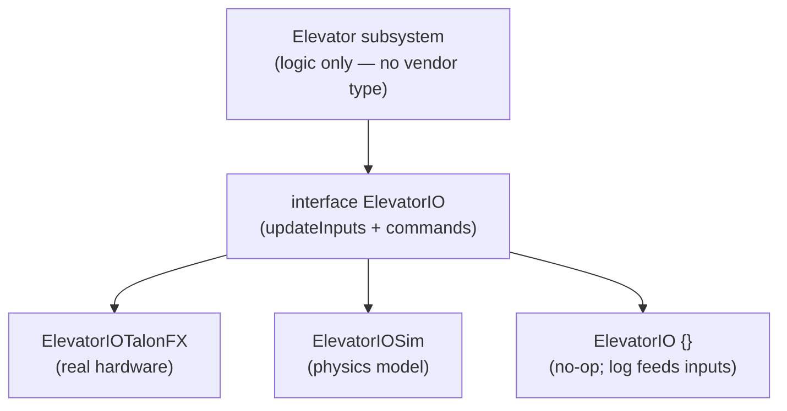

The IO seam is the single most widely shared idea in serious FRC code — present in roughly two-thirds
of the strong Java and Kotlin codebases, and the default rather than the exception among them. It is
the spine the rest of the architecture hangs from, so it gets named first.

## The problem it solves

WPILib hands every team a subsystem that owns its motors directly: the drivetrain holds `TalonFX`
objects, calls `setVoltage` on them, and reads `getPosition` back. That works, and it is where every
team starts. The coupling it leaves is the problem — the subsystem's logic is welded to specific
hardware. You cannot run it without the physical robot plugged in, you cannot swap a motor controller
without editing the logic, and you cannot replay a match through the code because the sensor reads
come straight off the CAN bus.

The IO seam breaks that weld with one move: **insert an interface between the subsystem's logic and
its physical devices.** The subsystem talks to the interface; concrete implementations talk to
hardware, to a physics simulation, or to nothing at all. The logic no longer knows or cares which.

## What it really is: Strategy

"IO layer" is FRC's house name for it, but the pattern has an older, more precise one: it is the
**Strategy pattern applied at subsystem granularity.** `ElevatorIO` is the strategy interface;
`ElevatorIOTalonFX`, `ElevatorIOSim`, and a no-op replay variant are interchangeable strategies; the
subsystem holds one of them without knowing which.

The value is the independence: a team writes the subsystem's logic *once* against the interface, then
swaps the strategy underneath — real hardware during a match, a physics model on a laptop, a
log-replay stub afterward, a different motor vendor next season — and none of those swaps touches the
interface or the subsystem. Selection happens in exactly one place, keyed off the robot's run mode, so
"run on the real robot" versus "run on a laptop" turns on a single line.

Two neighbors are worth naming so they don't get confused with it. A **factory method**
(`Elevator.create()`) is the *selection* step that picks the strategy. A **null object** (a
do-nothing implementation) is a full member of the strategy family whose methods are deliberately
empty, so a subsystem with disconnected hardware runs as a safe no-op instead of crashing.

## Why the pattern won

Three payoffs fall out of that one interface, and they explain why a powerhouse signature became a
regional default:

- **Simulation is free.** Swap the real implementation for the sim one — one line at construction —
  and the entire subsystem runs on a laptop with no robot. For a team with ten programmers and one
  robot on the cart, this is the whole game.
- **Unit testing becomes possible** — the seam's deferred dividend. Because a subsystem can be built
  with a sim implementation, you can drive it to completion on CI and assert on the result. Almost no
  other FRC teams test robot code at all, and the IO seam is what makes it mechanically possible.
- **Hardware swaps and replay stay local.** Changing a motor controller, supporting a practice robot,
  or replaying a recorded match touches one IO file — or, with AdvantageKit, none, because the log
  feeds the existing code.

## Reading it in the corpus

The seam appears in 24 of 55 teams, and a confirmation worth trusting: *every* team that builds an IO
interface also has the logged `Inputs` struct (zero exceptions). But naming misleads — the hardware
implementation is named *by device* (`ElevatorIOTalonFX`, `GyroIOPigeon2`), not "Real." Literal
`*IOReal` appears in only about 5 teams, so the robust signal is **an `interface *IO` with two or more
implementations, one of them a sim** — not a filename grep.

One distinction the corpus forces: an IO *directory* of concrete hardware wrappers is not an IO
*layer*. There must be an actual interface with swappable implementations behind it; tidy hardware
encapsulation alone is organization, not dependency inversion.

The seam has internal decisions — where the control loop sits, whether reads come through an inputs
struct or plain getters, when to collapse per-subsystem interfaces into one generic base — but those
are mechanics, and they live in [Part II](../part-2/16-hardware-abstraction.md). What matters here is
the shape: one interface, interchangeable strategies, selected in one place, swappable over time
without touching the logic above it. Next: the seam that the IO layer feeds — [the state
seam](06-the-state-seam.md).
