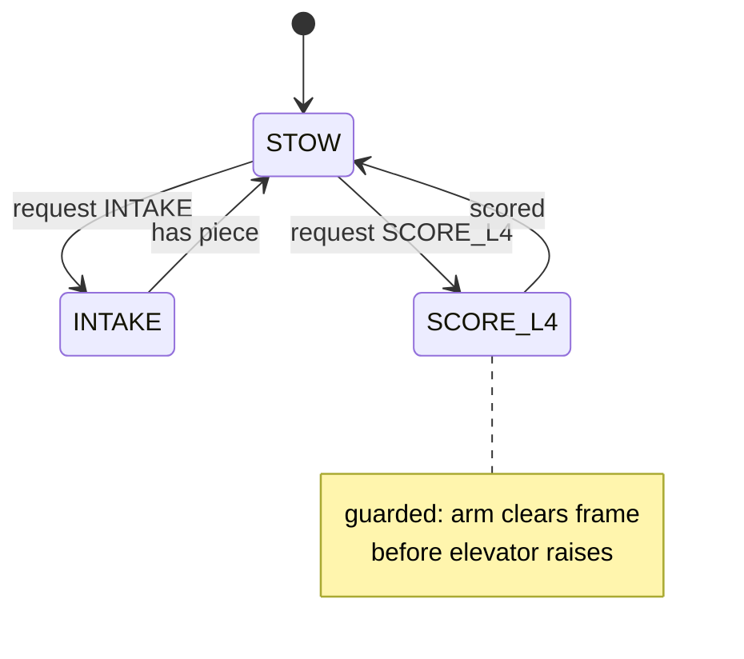

# 7. The coordination seam — the superstructure

The third seam turns one robot-wide *goal* into a coordinated set of subsystem setpoints, through a
single transition function that is allowed to *reorder or reject* a transition for safety. A button
asks for `SCORE_L4`; the superstructure decides the legal sequence — clear the frame, raise the
elevator, then score — that realizes it. It is the one object that sees every mechanism at once, so the
knowledge that "the arm must clear before the elevator rises" lives in exactly one place instead of
scattered across subsystems.

## Intent versus execution

The split that defines the seam is **intent versus execution.** A caller expresses *what it wants* — a
goal — and walks away. The superstructure owns *how each mechanism gets there* — the legal, sequenced
setpoints. There is no control loop here; each subsystem still closes its own loop through its IO. The
superstructure only decides which setpoint each subsystem should hold right now.

Because only the transition function writes setpoints, a caller *cannot* drive a mechanism into an
illegal configuration. The operator binding never commands a motor — it requests a goal, and the same
goal is reusable as an autonomous action. Re-tuning the scoring sequence becomes a one-place change.
This is also where kinematic interlocks belong: the guard that refuses to let two mechanisms occupy
the same space lives in the coordinator, not smeared across the subsystems that can't see each other.

## This is where teams diverge

The first two seams are near-consensus in their shape. Coordination is the richest point of
architectural divergence in FRC — there are six recognizable paradigms, and the rubric's D2 ladder
orders them by how much the transition logic is *data* rather than *code*:

| Level | Shape | Example |
|---|---|---|
| 1 | command composition — sequential/parallel groups, no coordinator | most teams |
| 2 | **wanted/current** FSM, distributed (one per subsystem + a top one) | 2910, 4099 |
| 2 | **centralized** `RobotManager` — one FSM, dumb subsystems | 581, 3128 |
| 3 | a `Superstructure` coordinator separating intent from execution, with kinematic safety | 254, 3476, 6328 |
| 4 | **state graph** — transitions are data, pathfind through legal states (JGraphT / A\*) | 6328, 254 |

The full six include two more at the frontier: the **behavior tree** borrowed from game AI (3015 ship
a complete runtime with a visual editor), and **inter-process message passing** (971's custom robotics
OS, where each subsystem is a separate process behind a typed message contract). Those are the
"transitions outgrew the FSM" tools; [Part II ch. 23](../part-2/23-coordination-graphs-trees.md) takes
the graph and tree forms apart, and the message-bus extreme is covered in
[ch. 13](13-lessons-from-outside.md).

The corpus shows `Superstructure` in 22 teams and a generic `*StateMachine` in 12, while the true
ceiling markers — `jgrapht`, a `WantedState` enum, a behavior-tree runtime — appear in one to three
teams each. A `Superstructure` at level 3, optionally backed by a state machine, is the common elite
path; the graph and tree are rare.

## The level-1-in-level-3-clothing trap

The seam's name is easy to fake. A class called `Superstructure` that only holds subsystem references
and exposes manual jog buttons is baseline command composition wearing a level-3 name — no goal enum,
no transition function, no interlock. Before crediting real coordination, confirm there is an actual
goal-request API and a single transition function that all transitions route through. The diagnostic
that separates the real thing from the impostor: *is intent separated from execution, and does one
function own every transition?*

A clean coordination seam is also naturally vendor-free — it imports the subsystems' public
`setGoal`/`setState` API, never their IO implementations and never a `com.ctre` type. A vendor import
here is a loud signal that a subsystem has leaked its hardware upward.

With the three seams named, the next chapter covers the one subsystem that behaves unlike all the
others and earns its own treatment even in the overview: [the drivetrain](08-the-drivetrain.md).
