> **Tool-facing spec** — read directly by `scaffold-robot`, `analyze-team`, and the `team-analyst` agent; kept here as the source of truth. The human-facing narrative is elite-arch Parts I–II under `docs/elite-arch/`.

# An Elite-Track FRC Software Architecture (Java + WPILib)

**A build spec for a competitive team.** This document defines a robot-code architecture you can build *foundation-first* and grow into a top-tier program without rewrites. The organizing principle: **build the seams, defer the payoffs.** Every advanced capability that distinguishes elite codebases — log replay, simulation, unit tests, vision fusion, time-optimal trajectories, on-the-fly pathfinding, kinematic interlocks — attaches to a small number of structural seams. If you build those seams correctly in week one, each advanced feature later becomes an *addition* at a known attachment point rather than a *refactor*.

The spec assumes FRC fluency (command-based, WPILib, vendor libraries). It is written against the patterns that recur across the elite corpus and against the eight-dimension sophistication rubric (D1 architecture … D8 sustainability). Where a real local team illustrates a pattern, it's named: 4738 Patribots (per-mechanism IO interfaces), 5137 Iron Kodiaks (generalized `MotorIO`), 3647 Millennium Falcons (maple-sim + 254-style bases), 3128 Aluminum Narwhals (`RobotManager` superstructure FSM).

---

## 1. The thesis: three seams carry the whole program

There are exactly three seams that matter. Build these and nothing else fancy on day one.

1. **The IO seam** — one `XxxIO` interface per subsystem, sitting at the line between subsystem logic and physical devices. This is the spine (rubric D1). It is what later makes simulation, replay, and tests possible *for free*, because all three are just different implementations of, or feeds into, the same interface.

2. **The state seam** — a single `RobotState` object that owns the robot's best estimate of the world (pose, and later game-piece state) behind a pose estimator. Control and decisions read from it; sensors write to it. This is where vision fusion attaches later (D7) without touching subsystems.

3. **The coordination seam** — a `Superstructure` coordinator that turns one robot-wide *goal* into per-subsystem setpoints through a single guarded transition function. Intent (what we want) is separated from execution (how each mechanism gets there). This is where interlocks, motion planning, and eventually a state graph attach later (D2).

A fourth, cross-cutting decision — **the logging contract** — is settled at the IO seam: each IO interface exposes an **`Inputs` struct** that captures everything coming back from hardware. That struct is the single artifact that both logging stacks consume, which is what lets you defer the AdvantageKit-vs-DogLog choice (see §4) without it leaking into subsystem code.

> **Corpus reality check** (measured across 55 season repos in `data/code-index.duckdb`). These three seams are the **elite-tier target, not the median**: the IO seam appears in 24 teams (44%), a `RobotState` class in 26 (47%), and a coordinator (`Superstructure`/`RobotManager`) in 23 (42%) — but **all three together in only 10 teams (18%)**. The pieces are individually common; assembling the full trio is what separates the top tier. Two encouraging confirmations: *every* team that builds an IO interface also has the `Inputs` struct (0 exceptions), and `addVisionMeasurement` appears in 50 of 55 teams — pose estimation is a solved baseline, so the state seam's value is **centralizing** it, not inventing it.

> **Why foundation-first works here:** the IO seam has a deferred dividend. On day one an `XxxIOSim` can be an empty stub and you've lost nothing. The moment you fill it with physics you get simulation (D3); the moment you point a test at it you get unit tests (D4); the moment you run the robot in `REPLAY` mode the *same* inputs struct replays a logged match (D5). You do not rebuild anything — you populate seams you already cut.

---

## 2. Foundation architecture (what you build first)

### 2.1 Layered overview

The foundation is the dark core. Everything outside it is an add-on that plugs into a seam the core already exposes (§3). Build inside-out.

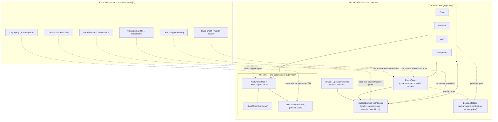

### 2.2 The IO seam (rubric D1 — the spine)

An IO layer is **the Strategy pattern applied at subsystem granularity**: one interface per subsystem, at the boundary between the subsystem's logic and its physical devices, with interchangeable implementations selected at construction. "IO layer" names a *location* (where the boundary sits); "hardware abstraction" is a *property* an interface may have more or less of. Keep them distinct.

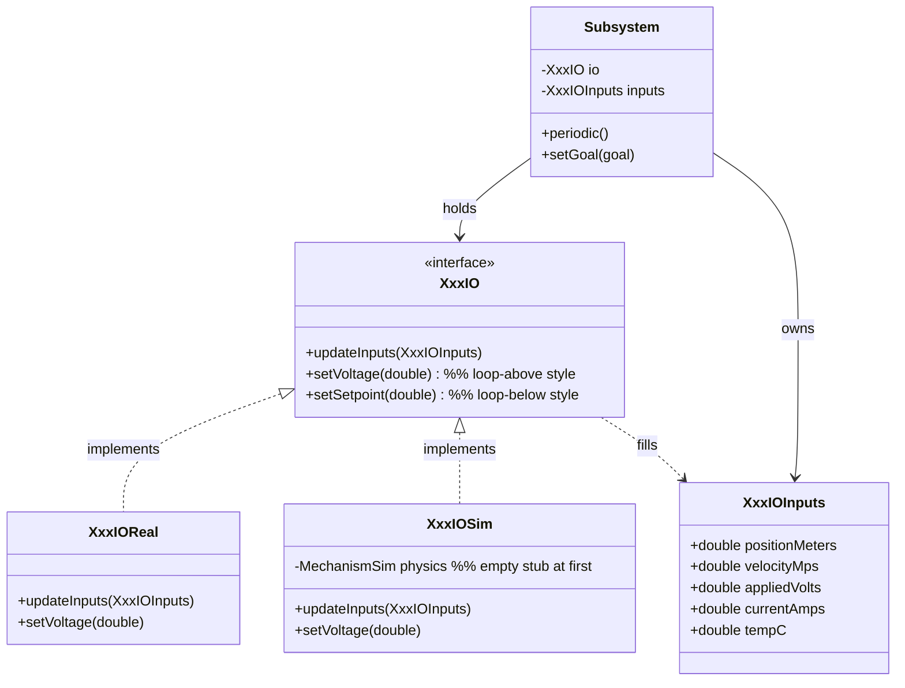

**Two decisions to make per subsystem, and make them deliberately:**

*Decision A — where the control loop lives ("the line").* The single diagnostic that classifies any IO interface: **which side of the interface is the PID+feedforward on?**

| | Loop **above** the line | Loop **below** the line |
|---|---|---|
| Interface command | `setVoltage(volts)` | `setSetpoint(inches)` |
| Reads as | a device pipe (HAL-like) | a subsystem-intent contract |
| PID/FF written | once, in the subsystem | once per implementation |
| Implementations | trivial (forward volts) | full bundles (each runs a loop) |
| Use when | you want one tuning, sim parity is easy | you lean on on-motor control (CTRE MotionMagic) |

Recommendation for a foundation: **loop above the line** (`setVoltage`) for mechanisms you simulate, because the sim and real implementations then share the subsystem's one controller and stay in parity for free. Push the loop below the line only where you deliberately exploit firmware control (e.g. Phoenix 6 MotionMagic on a swerve azimuth).

*Decision B — inputs struct vs. plain getters.* This is the **logging fork** and it's why §4 is deferrable. The **inputs-struct** style (the interface fills a mutable `XxxIOInputs` object every cycle via `updateInputs`) means every hardware reading is captured in one place — which is exactly what AdvantageKit auto-logs and replays, and exactly what DogLog can serialize field-by-field. The plain-getter style (`position()`, `velocity()`) is simpler but logs nothing automatically. **Build the inputs-struct style.** It is the one decision that keeps *both* logging stacks (and replay) available later; the cost is a few lines of boilerplate per subsystem (annotate the struct `@AutoLog` for AdvantageKit, or hand-log its fields for DogLog).

*The selection point.* Exactly one place chooses implementations, keyed off the robot's run mode:

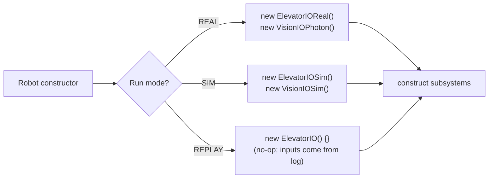

The `REPLAY` no-op implementation does nothing and reads nothing — in replay the inputs struct is overwritten from the log before the subsystem sees it. You write this empty implementation on day one; it costs nothing and it is the entire reason replay later requires zero new subsystem code.

**Generalize only after repetition.** Start with hand-rolled per-subsystem interfaces (4738's style: `ElevatorIO`, `ArmIO`, `ClimbIO`). Once three position-controlled mechanisms look identical, extract a generic base — 5137's `MotorIO` with `MotorIOTalonFX`/`MotorIOSparkMax`, or a 254-style `ServoMotorSubsystem`. Generalizing first is premature; generalizing after the third copy is library-grade (D1 level 4, and feeds D8).

### 2.3 The runtime loop (how data flows every 20 ms)

This is the heartbeat. Memorize it; every scenario in §5 is a specialization of it.

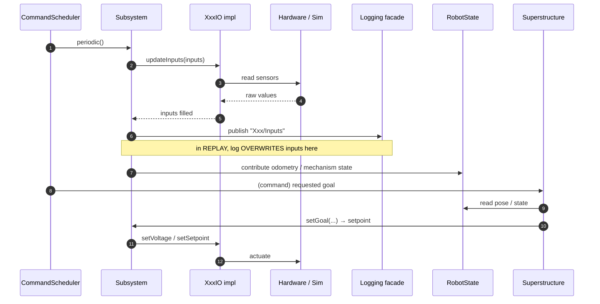

The invariant: **read (updateInputs) → log → decide → actuate**, in that order, every cycle. Logging happens immediately after reading so the log is a faithful record of what the code saw — which is the precondition for deterministic replay.

### 2.4 The state seam — `RobotState`

A single object owns the pose estimate. Subsystems feed it odometry; later, vision feeds it corrections. Decisions and pathing *read* from it. Keeping this central (rather than letting the drive subsystem privately own the estimator) is what lets vision, pathfinding, and auto all share one consistent world model — and is the difference between D7 level 2 (pose estimation exists) and level 4 (a world model is the architecture).

```java
public class RobotState {
    private final SwerveDrivePoseEstimator estimator;     // foundation
    // later: TimeInterpolatableBuffer<Pose2d> history;   // D7 L4 seam
    public void addOdometry(SwerveModulePosition[] p, Rotation2d g, double t) {...}
    public void addVisionMeasurement(Pose2d p, double t, Matrix<N3,N1> stdDevs) {...} // vision attaches here
    public Pose2d getPose() {...}
}
```

On day one only `addOdometry` and `getPose` are used. `addVisionMeasurement` exists but is uncalled — it is the vision seam, pre-cut.

### 2.5 The coordination seam — `Superstructure` + guarded transitions

The coordinator takes **one robot-wide goal** and fans it out to subsystems, through a single transition function that is allowed to *reject or reorder* a transition for safety. Intent is separated from execution: a button requests `SCORE_L4`; the Superstructure decides the legal sequence of subsystem setpoints that realizes it.

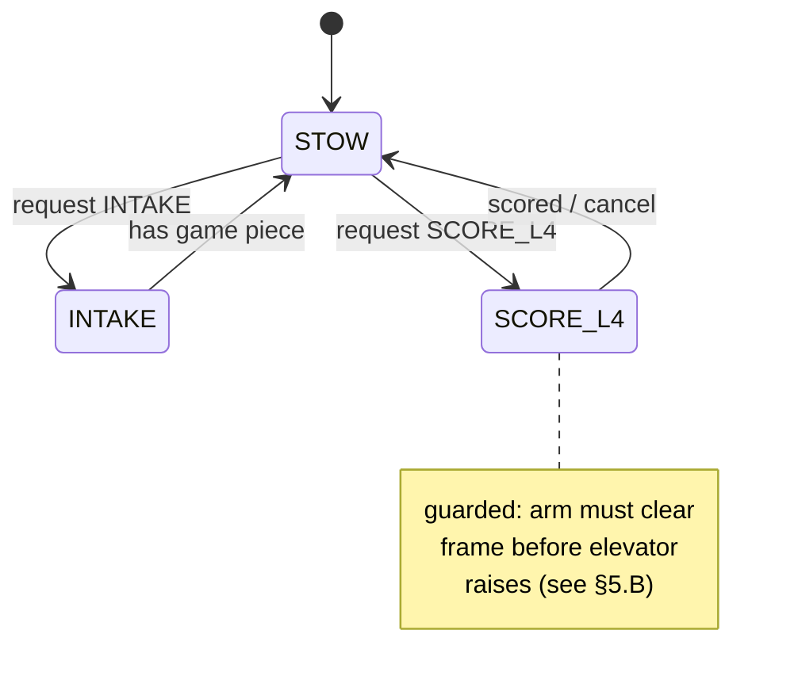

The foundation version of the transition function can be a `switch` over a goal enum that sets subsystem setpoints (3128's `RobotManager` pattern). The seam is that **all transitions pass through one function** — so later you can replace its body with a guarded transition table, a motion planner, or a graph search (D2 levels 3–4) without changing a single caller.

```java
public class Superstructure {
    public enum Goal { STOW, INTAKE, SCORE_L4, CLIMB }
    private Goal goal = Goal.STOW;
    public Command requestGoal(Goal g) { return runOnce(() -> applyGoal(g)); }
    private void applyGoal(Goal g) {       // <-- the seam. interlocks live here.
        switch (g) {
            case SCORE_L4 -> { arm.setGoal(CLEAR); elevator.setGoal(L4); arm.setGoal(SCORE); }
            // ...
        }
    }
}
```

### 2.6 Package layout (the foundation, on disk)

The `Drive`/`Elevator`/`Arm`/`Manipulator` below are illustrative — `Manipulator` is actually
rare. The subsystems that recur most across the corpus are **vision, intake, drive, shooter,
climber, elevator** (then arm, LEDs, indexer, turret); `commands/`, `subsystems/`, and
`Constants` are near-universal (53–54/55). Two structural elements worth planning for that this
layout omits: a `generated/` package (CTRE Tuner X swerve output, 19 teams) and **vision as its
own top-level package** (31 teams) rather than a `VisionIO` tucked under `drive/`. LEDs is a
real subsystem (~20 teams), not an afterthought.

```text
frc/robot/
  Robot.java                 // run-mode selection; AdvantageKit/DogLog init
  RobotContainer.java        // bindings: button -> superstructure.requestGoal(...)
  RobotState.java            // the state seam
  Constants.java
  superstructure/
    Superstructure.java      // the coordination seam
  subsystems/
    drive/   Drive.java DriveIO.java DriveIOInputs DriveIOReal DriveIOSim
    elevator/ Elevator.java ElevatorIO.java ... IOReal IOSim
    arm/      ...
  util/                      // later promoted to a versioned team lib (D8)
```

The `*IO`, `*IOInputs`, `*IO<impl>`, `*IOSim` quartet per subsystem **is** the foundation's signature. If a new member can find those four files for any mechanism, the architecture is intact.

> **Naming, as the corpus actually does it.** The sim impl is reliably `*IOSim` (19 teams), but the *hardware* impl is named **by device, not "Real":** `ElevatorIOTalonFX`, `ModuleIOSparkMax`, `GyroIOPigeon2`, `VisionIOLimelight`/`IOPhotonVision`. Literal `*IOReal` is used by only ~5 teams — so write `XxxIOTalonFX`/`XxxIOKrakenX60` (it documents the vendor at the seam) and don't expect a `Real` file. The `REPLAY` no-op and `*IONull` null-object are genuinely rare in practice (~1 team ships a replay variant); build the empty `XxxIO(){}` if you want AdvantageKit replay, but know almost no one collects that dividend (§3, rung 7). Real IO interfaces also carry more than `updateInputs`/`setVoltage`: expect `setBrakeMode`, `setCurrentLimit`, `runCharacterization`, `setPID`, and `stop` — the interface is the subsystem's full hardware contract, not just a setpoint.

---

## 3. The progression — adding the fancy stuff onto seams

Each rung below is an *addition at a named seam*, not a refactor. The table is the map; the diagram shows where each attaches.

| Rung | Capability | Rubric | Attaches to | New code, roughly |
|---|---|---|---|---|
| 1 | Mechanism physics in sim | D3 L2 | fill `XxxIOSim` | `ElevatorSim`/`FlywheelSim` inside the Sim impl |
| 2 | Unit tests | D4 L2 | construct subsystem with `XxxIOSim` | `@Test`: step sim, assert behavior |
| 3 | Vision pose fusion | D7 L2–3 | `RobotState.addVisionMeasurement` + `VisionIO` | PhotonVision/Limelight impl + std-dev tuning |
| 4 | Authored autos | D6 L2 | Superstructure goals as named commands | PathPlanner `.path`/`.auto`, `AutoBuilder` |
| 5 | Time-optimal trajectories | D6 L3 | swap path source | Choreo `.traj` referenced where time matters |
| 6 | On-the-fly pathfinding / align | D6 L3–4 | reads `RobotState.getPose()` | pathfind-to-pose, repulsor field |
| 7 | Deterministic log replay | D5 L4 | `REPLAY` run mode (already wired) | **none in subsystems** — flip the mode |
| 8 | Smart coordination | D2 L3–4 | replace `applyGoal` body | guarded table → motion planner → state graph |
| 9 | Versioned team library | D8 L3–4 | promote `util/` + generic IO base | extract, version, consume as dependency |

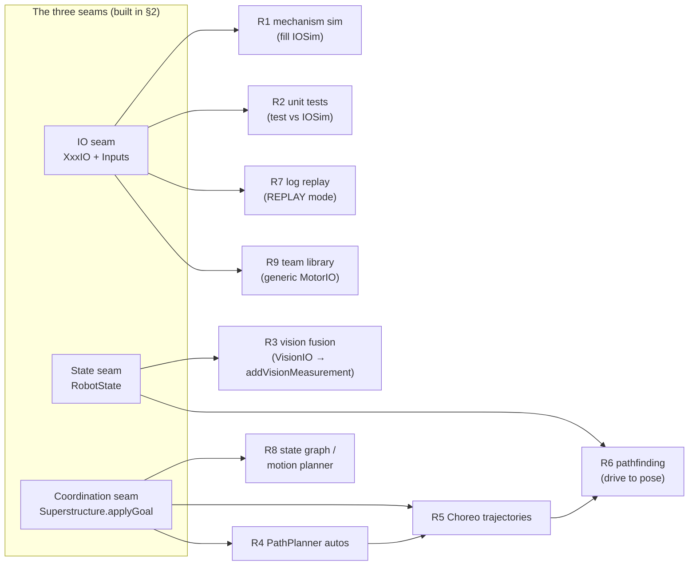

**The deferred-dividend rungs (1, 2, 7) are the ones teams skip and shouldn't.** Filling `IOSim` (R1) costs an afternoon and unlocks both testing (R2) and replay (R7). The corpus finding is blunt: almost every team builds the IO seam and never collects R2/R7. Collecting them is the clearest marker of real software-engineering culture — and the foundation already paid for them.

---

## 4. The logging contract (deferring AdvantageKit vs DogLog)

Both stacks consume the **`Inputs` struct** from §2.2; that is the seam that makes them swappable. Decide later, by choosing whether you want deterministic replay.

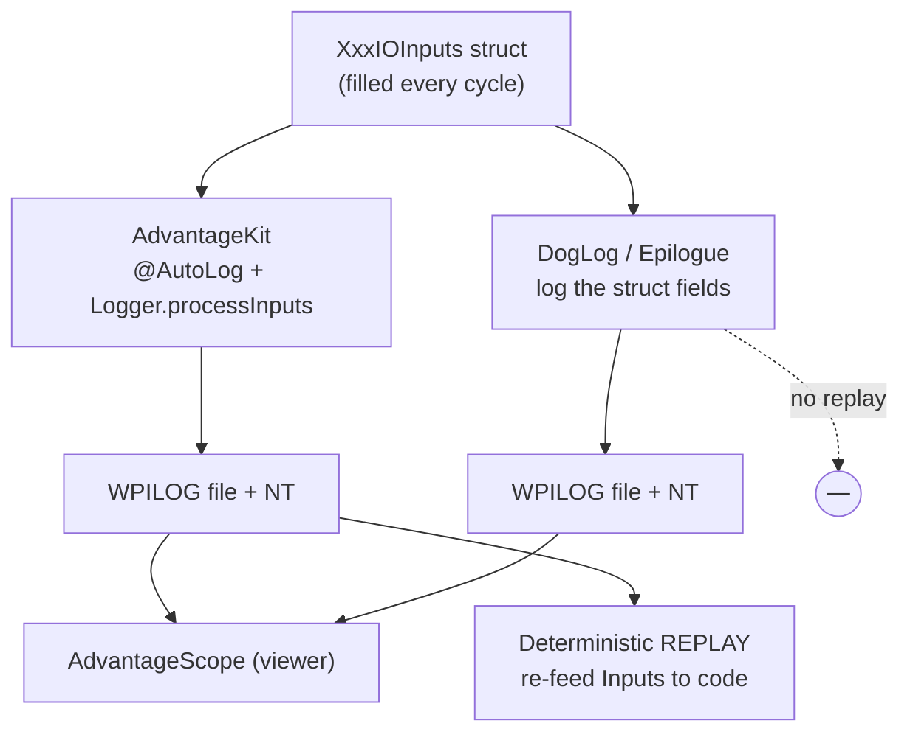

| | AdvantageKit | DogLog / Epilogue |
|---|---|---|
| Logs the Inputs struct | yes, via `@AutoLog` | yes, you call `DogLog.log(...)` |
| **Deterministic replay** | **yes** (re-runs your code on the log) | no |
| Setup cost | higher (run-mode plumbing, IO discipline) | low |
| Best when | you want to debug matches off-robot, top-tier | you want telemetry fast, replay not yet worth it |
| Foundation requirement | inputs-struct IO (you built this) | inputs-struct IO (same) |

Recommendation: build inputs-struct IO now; start on **DogLog** for speed; migrate to **AdvantageKit** when the team is ready to invest in replay. Because the seam is the struct, the migration touches the logging facade and `Robot.java`, not the subsystems.

---

## 5. Scenarios — walking the data flow

### 5.A How the robot makes a path from what it sees

*Goal: see the field, decide where to score, drive there.* This is the marquee flow and it touches all three seams in sequence: **VisionIO → RobotState → Superstructure → pathfinder → DriveIO.**

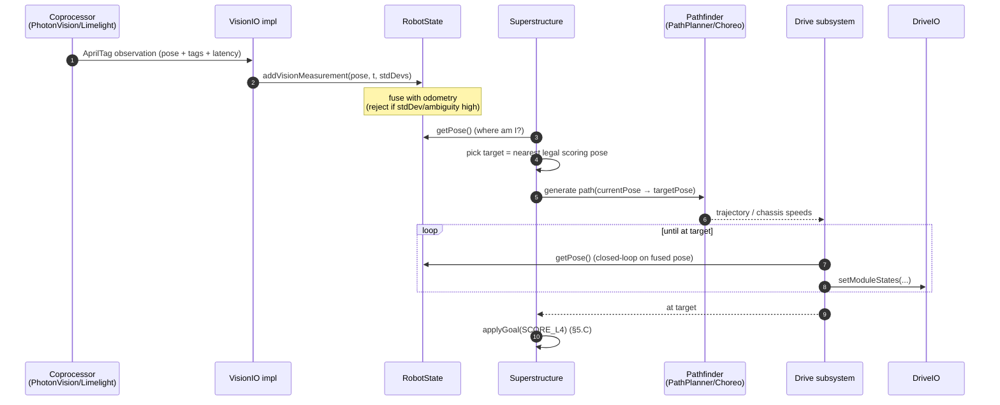

The point: **vision never talks to drive.** The camera writes a measurement to `RobotState`; everything downstream reads pose from the one fused estimate. Swapping PhotonVision for Limelight is a new `VisionIO` impl; swapping PathPlanner for Choreo, or adding on-the-fly pathfinding, changes only the `Pathfinder` participant. The seams localize every change.

### 5.B How it refuses an illegal physical state (interlock)

*Constraint: the manipulator/scoop must not be open while the elevator is raised (they collide).* This lives in exactly one place — the Superstructure's guarded transition (the coordination seam) — never scattered across subsystems.

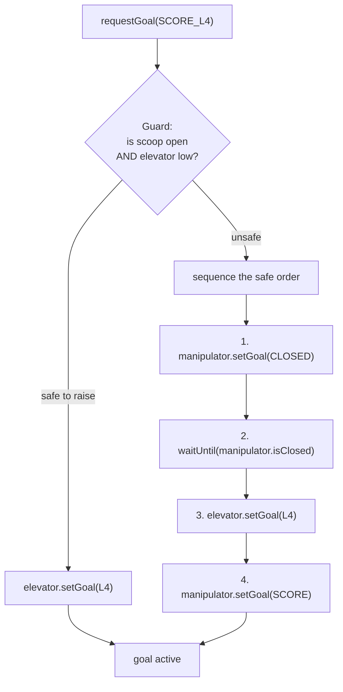

Two ways to implement the guard, in increasing sophistication (this is the D2 progression in miniature):

- **Foundation:** `applyGoal` hand-sequences the safe order with `Commands.sequence(...)` and `waitUntil(elevator::isStowed)`. Each subsystem exposes a cheap predicate (`isClosed()`, `isStowed()`) read from its inputs struct.
- **Later (R8):** a declarative transition table or a motion planner that knows mechanism geometry and computes the safe interpolation automatically. Because every transition already routes through `applyGoal`, you replace the body, not the callers.

The subsystems stay dumb — they execute setpoints and report state. The *knowledge that two states are mutually exclusive* lives in the coordinator, which is the only object that sees all mechanisms at once.

### 5.C Operator requests a score (intent vs execution)

*An operator presses "score L4."* Demonstrates why intent is separated from execution.

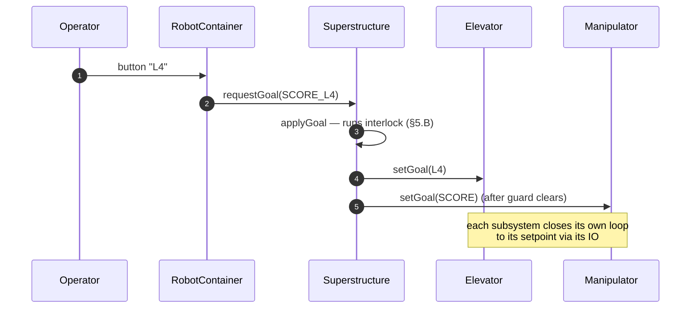

The operator expresses *intent* (a goal). The Superstructure owns *execution* (the legal, sequenced setpoints). The operator binding never commands a motor — so re-tuning the scoring sequence is a one-place change, and the same `SCORE_L4` goal is reusable as an autonomous action (§5.A step "applyGoal").

### 5.D Replay a match to find the bug

*The robot mis-scored in qualifier 42; reproduce it at your desk.* This scenario requires **zero code written for the purpose** — it is the dividend of the inputs-struct IO seam plus AdvantageKit.

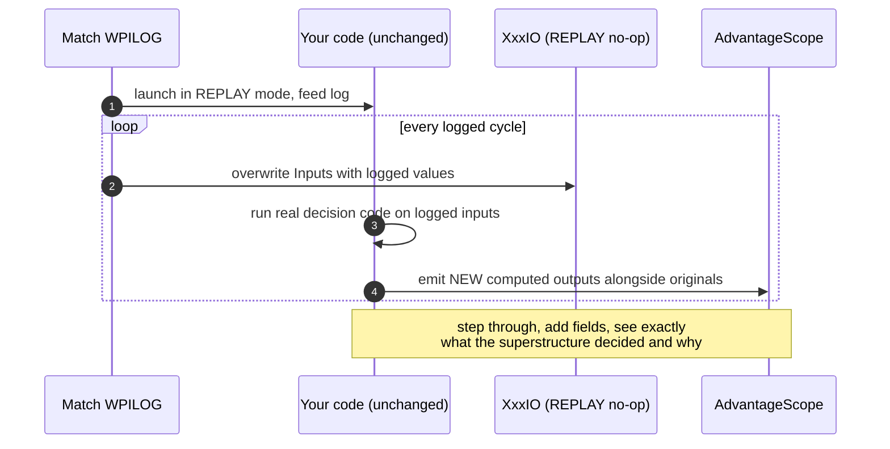

You run the *actual* robot code against the *actual* sensor inputs from the match, deterministically, and can add new logged fields to inspect decisions that weren't logged live. This is why elite teams debug in hours what others debug across a week — and the only prerequisite is that the foundation logged the inputs struct (§2.2) and wired a `REPLAY` mode (§2.2 selection point).

---

## 6. Third-party tools — what plugs into which seam

The architecture is tool-agnostic *at defined seams*. Pick tools per seam; swapping one is a localized change.

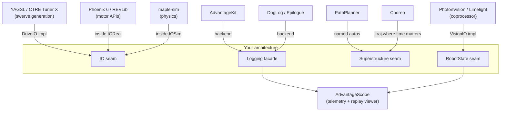

| Tool | Seam it attaches to | What it gives you | Tradeoff / when |
|---|---|---|---|
| **AdvantageScope** | reads the logging facade + NT | match/sim telemetry viewer, 3D field, mechanism views, log scrubbing | Always. It's the lens on every other seam; commit layouts to the repo. |
| **AdvantageKit** | logging backend | structured logging **+ deterministic replay** | When you want off-robot debugging; needs IO discipline (you have it). |
| **DogLog / Epilogue** | logging backend | fast structured logging, low ceremony | When you want telemetry now and replay isn't yet worth the plumbing. |
| **PhotonVision / Limelight** | `VisionIO` → `RobotState` | AprilTag pose, target tracking, on a coprocessor | Either; a `VisionIO` impl each. Add a `VisionIOSim` for sim parity. |
| **PathPlanner** | Superstructure goals as autos | GUI path/auto authoring, `AutoBuilder`, event markers | Foundation auto layer; pairs autos with named Superstructure goals. |
| **Choreo** | swap path source where time matters | time-optimal trajectories | Add on top of PathPlanner for the legs where seconds decide matches. |
| **maple-sim** | inside `XxxIOSim` / `DriveIOSim` | rigid-body physics for whole-robot sim (3647 locally) | Rung 1+ when you want sim to *surprise* you, not just echo setpoints. |
| **YAGSL / CTRE Tuner X** | `DriveIO` implementation | generated, configured swerve | Foundation drive; keep it behind `DriveIO` so it's swappable. |
| **Phoenix 6 / REVLib** | inside `XxxIOReal` | device control, on-motor loops, signal logging | Vendor choice; confine to `IOReal` so subsystems stay vendor-agnostic. |

**The discipline that makes tools swappable:** a vendor type (a `TalonFX`, a `PhotonCamera`) must never appear in a subsystem, a command, or the Superstructure — only inside an `IO<impl>`/`IOSim` implementation. If a `com.ctre`/`org.photonvision` import shows up above the IO line, the seam has leaked and a tool swap has become a refactor. Enforce it with a spotless/checkstyle rule (which also feeds D8).

> **This is the discipline teams actually skip.** Of the 24 corpus teams that built an IO seam, **22 still import `com.ctre`/`com.revrobotics` above the line** (in a subsystem, command, or superstructure file). Building the IO interface is the easy 80%; keeping vendor types *out* of everything above it is the unglamorous 20% almost no one finishes — which is exactly why it's worth a lint rule rather than good intentions. Treat clean vendor confinement as a distinguishing D1-level-4 / D8 marker, not a given.

---

## 7. Build order (definition of done per step)

1. **Command-based skeleton** — `Robot`, `RobotContainer`, one `Drive` subsystem, run-mode enum. *Done when:* teleop drives.
2. **IO seam on Drive** — `DriveIO`/`Inputs`/`IOReal`/`IOSim`(stub)/`IO(){}`(replay); inputs-struct style. *Done when:* code runs in SIM mode with a stub and doesn't crash.
3. **RobotState** — pose estimator fed by drive odometry. *Done when:* AdvantageScope shows the robot pose on the field in sim.
4. **Logging facade** — DogLog or AdvantageKit publishing every subsystem's inputs. *Done when:* every mechanism's state is visible in AdvantageScope.
5. **One mechanism, full quartet** — e.g. Elevator with IO + sim physics (R1). *Done when:* a unit test (R2) steps the sim and asserts the elevator reaches a setpoint.
6. **Superstructure** — goal enum + `applyGoal` with one real interlock (§5.B). *Done when:* an illegal request is provably sequenced safely.
7. **Vision** — `VisionIO` → `RobotState.addVisionMeasurement` with std-dev tuning (R3). *Done when:* pose snaps to AprilTags in sim and on robot.
8. **Autos** — PathPlanner autos built from Superstructure goals (R4), then Choreo where time matters (R5). *Done when:* a multi-piece auto runs in sim before the real robot exists.
9. **Collect the dividends** — turn on AdvantageKit `REPLAY` (R7); broaden the test suite. *Done when:* you can replay a sim/match log and step through decisions.
10. **Extract the library** (R9) when patterns have repeated three times. *Done when:* `MotorIO` and friends live in a versioned, consumed dependency.

Steps 1–6 are the foundation. Steps 7–10 are the climb. Nothing in 7–10 modifies the seams built in 1–6; they only fill them.

---

*Grounded in the elite FRC corpus analysis and the eight-dimension sophistication rubric. Patterns illustrated by local teams 4738 (per-mechanism IO), 5137 (generalized MotorIO), 3647 (maple-sim + 254-style bases), 3128 (RobotManager superstructure).*
