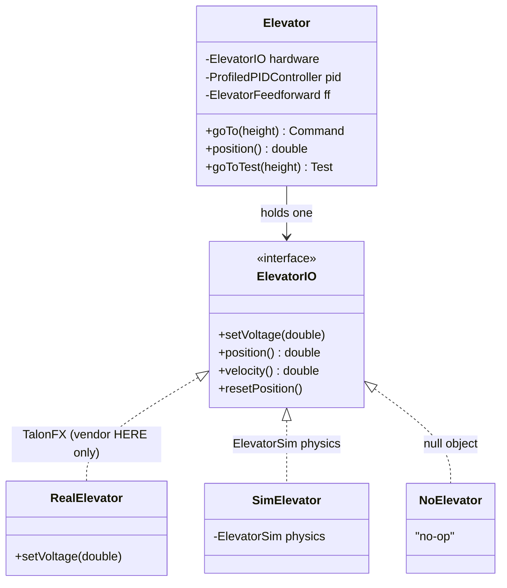

# Linear Position Subsystems — Elevator, Climber

> **Prereq:** read [`00-anatomy-of-a-subsystem.md`](00-anatomy-of-a-subsystem.md) first — it
> defines the IO/subsystem/Sim quartet, the test/library/vendor ethic, and the archetype map
> this doc instantiates. This is the reference doc of the series; the others follow its shape.
>
> *Code is quoted to study the technique, not to copy. Build the contract for **your** mechanism.*

---

## 1. What it does

A **linear position mechanism** moves a carriage to a commanded **height** along a rail and
holds it against gravity. The robot has one if a thing goes *up and down* to setpoints: an
**elevator** (the canonical case) or the extension stage of a **climber**. The job is "get to
height *h* and stay there," so the whole subsystem reduces to a position controller plus a
gravity feedforward.

Both mechanisms collapse to one archetype because the control truth is identical — only the
constants and a few safety concerns differ. The corpus bears this out: **17 teams** ship a
clean `ElevatorIO` + `ElevatorIOSim`, **19** an ` XxxIO` for a climber; an Elevator doc and a
Climber doc would be ~85% the same file. Climber-specific concerns (a ratchet, one-directional
load, a "climbed" latch) live in §5.

## 2. How it operates — the control archetype

### 2.1 The control truth
State is **position** (meters) and its derivative **velocity** (m/s). Control is **feedback on
position + feedforward for gravity**: a profiled PID drives the error to zero while a constant
`kG` term holds the carriage up. Everything else (the motor count, gearing, soft limits) is a
constant.

### 2.2 Where the loop lives ("the line")
This is the one deliberate design choice (`elite-architecture.md` §2.2). Two real styles in the
corpus:

- **Loop above the line (recommended for a mechanism you simulate).** The interface is a *device
  pipe* — `setVoltage(v)` plus `position()`/`velocity()` getters. The subsystem owns the one
  `ProfiledPIDController` + `ElevatorFeedforward`; Sim and Real run the **same** controller, so
  they stay in parity for free. SciBorgs (1155) builds it this way.
- **Loop below the line (use to exploit firmware control).** The interface is an *intent
  contract* — `runPosition(rad, ff)` / `runToHeight(h)` — and each implementation runs its own
  loop, typically Phoenix 6 MotionMagic on the motor. 6328 and 3636 do this. The cost: the Sim
  impl must *re-implement* the loop, and the two can drift (3636's `ElevatorIOSim` hand-rolls a
  `ProfiledPIDController` that the real motor doesn't use).

### 2.3 The sim model that backs it
WPILib's **`ElevatorSim`** — a physics model of a gravity-loaded carriage on a motor+gearbox.
It is the single reason this subsystem is testable: the Sim impl wraps it, and a test steps it.



## 3. The contract — `ElevatorIO`

### 3.1 The interface (loop-above form)
| Method | Crosses the line as | Why |
|---|---|---|
| `setVoltage(double v)` | command (output) | the only actuation; subsystem computes `v` from PID+FF |
| `position()` → meters | sensor (input) | feedback for the controller and `atGoal()` |
| `velocity()` → m/s | sensor (input) | feedforward / homing |
| `resetPosition()` | command | zero the encoder after a homing move |

That's the whole contract for the recommended style. The loop-below style replaces `setVoltage`
with `runPosition(positionRad, feedforward)` and adds `setPID(...)`.

### 3.2 The inputs (when you log with an `Inputs` struct)
SciBorgs uses plain getters; AdvantageKit teams (6328, 190) capture the same readings in an
`@AutoLog` `Inputs` struct instead — same information, auto-logged and replayable. Typical fields:

| Field | Unit | Source |
|---|---|---|
| `positionRad` / `leftHeight` | rad or m | encoder |
| `velocityRadPerSec` | rad/s | encoder |
| `appliedVolts` | V | motor |
| `supplyCurrentAmps` | A | motor (stall / jam detection) |
| `tempCelsius` | °C | motor |
| `motorConnected` | bool | CAN status (degrade safely if unplugged) |

### 3.3 What the contract omits — on purpose
No `TalonFX`, no `SparkMax`, no game logic ("score L4"), no other subsystem. It is **only** volts
out and meters in. That omission is what makes §6 possible.

## 4. Real implementations from the corpus

The cleanest end-to-end example is SciBorgs (1155) Reefscape 2025: the full quartet plus a real
unit test, and the descriptive `Real/Sim/No` naming that reads better than `IOReal/IOSim`.

### 4.1 The interface
*1155 SciBorgs — `Reefscape-2025/.../robot/elevator/ElevatorIO.java`*
```java
public interface ElevatorIO extends AutoCloseable {
  /** @param voltage Voltage inputted to gearbox. */
  public void setVoltage(double voltage);

  /** @return The encoder value in meters. */
  public double position();

  /** @return The encoder value in meters per second. */
  public double velocity();

  /** Resets the elevator encoder to a measurement of 0. */
  public void resetPosition();
}
```
Twelve lines of logic. No imports at all — not even WPILib. That is the spine.

### 4.2 The hardware implementation — the ONE place a vendor type appears
*1155 SciBorgs — `Reefscape-2025/.../robot/elevator/RealElevator.java`*
```java
import com.ctre.phoenix6.hardware.TalonFX;          // ◀ vendor import — allowed HERE, nowhere above
import com.ctre.phoenix6.controls.Follower;
// ...
public class RealElevator implements ElevatorIO {
  private final TalonFX leader   = new TalonFX(FRONT_LEADER, CANIVORE_NAME);
  private final TalonFX follower = new TalonFX(BACK_FOLLOWER, CANIVORE_NAME);

  public RealElevator() {
    follower.setControl(new Follower(FRONT_LEADER, true));
    // ...brake mode, current limit, sensor-to-mechanism ratio...
  }

  @Override public void setVoltage(double voltage) { leader.setVoltage(voltage); }
  @Override public double position() { return leader.getPosition().getValueAsDouble(); }
  @Override public double velocity() { return leader.getVelocity().getValueAsDouble(); }
  @Override public void resetPosition() { leader.setPosition(0); }
}
```
`com.ctre` lives in this file and only this file. Swapping to a SparkMax means writing one new
`ElevatorIO` impl — the subsystem, the test, and the rest of the robot never know.

### 4.3 The simulation implementation — physics wired in
*1155 SciBorgs — `Reefscape-2025/.../robot/elevator/SimElevator.java`*
```java
public class SimElevator implements ElevatorIO {
  private final ElevatorSim elevator =
      new ElevatorSim(
          LinearSystemId.createElevatorSystem(
              DCMotor.getKrakenX60(2), WEIGHT.in(Kilograms), SPROCKET_RADIUS.in(Meters), GEARING),
          DCMotor.getKrakenX60(2),
          MIN_EXTENSION.in(Meters), MAX_EXTENSION.in(Meters), true, MIN_EXTENSION.in(Meters));

  @Override public void setVoltage(double voltage) {
    elevator.setInputVoltage(voltage);
    elevator.update(Constants.PERIOD.in(Seconds));   // advance the physics one tick
  }
  @Override public double position() { return elevator.getPositionMeters(); }
  @Override public double velocity() { return elevator.getVelocityMetersPerSecond(); }
  @Override public void resetPosition() { elevator.setState(0, 0); }
}
```
Same four methods, backed by a gravity-aware physics model instead of a motor. Imports are
**WPILib only**. This file is the entire reason the subsystem is testable on a laptop.

### 4.4 The subsystem — consumes the contract, owns the loop
*1155 SciBorgs — `Reefscape-2025/.../robot/elevator/Elevator.java` (abridged)*
```java
public class Elevator extends SubsystemBase implements AutoCloseable {
  private final ElevatorIO hardware;
  private final ProfiledPIDController pid = new ProfiledPIDController(kP, kI, kD, /*constraints*/);
  private final ElevatorFeedforward ff   = new ElevatorFeedforward(kS, kG, kV, kA);

  // the selection point: one place chooses the implementation
  public static Elevator create() {
    return new Elevator(Robot.isReal() ? new RealElevator() : new SimElevator());
  }
  public static Elevator none() { return new Elevator(new NoElevator()); }

  public Command goTo(double height) { return run(() -> update(height)).finallyDo(() -> hardware.setVoltage(0)); }

  private void update(double goal) {                 // the loop lives ABOVE the line
    double feedback    = pid.calculate(hardware.position(), goal);
    double feedforward = ff.calculateWithVelocities(/*...*/);
    hardware.setVoltage(feedback + feedforward);      // only volts cross down
  }
}
```
The subsystem holds **one** `ElevatorIO` and never names a motor type. `create()` is the single
selection point; `update()` is the controller both Real and Sim share.

## 5. Variations across teams

| Variation | Team | How it differs | Reference |
|---|---|---|---|
| `@AutoLog` inputs + loop **below** | 6328 | interface is `runPosition(rad, ff)` / `runVolts`; an `@AutoLog ElevatorIOInputs` record carries all readings; the TalonFX runs the position loop | `RobotCode2025Public/.../superstructure/elevator/ElevatorIO.java` |
| Typed units (Kotlin) | 3636 | `var leftHeight = 0.meters`; methods take `Distance`/`Voltage`; `runToHeight(Distance)` via MotionMagic. Compile-time unit safety; names the impl `ElevatorIOReal` | `frc-2025/.../subsystems/elevator/ElevatorIO.kt` |
| Null object | 1155 | `NoElevator` returns 0 / does nothing, so the robot runs with the mechanism unplugged (`Elevator.none()`) | `Reefscape-2025/.../elevator/NoElevator.java` |
| **Climber** = linear + load | 190 | same shape, simpler contract (`setVoltage`, `stop`); the `@AutoLog` inputs add an `isClimbed` latch; one-directional load, often a ratchet, so homing/limits matter more than precision | `2k24-Offseason-Code/.../subsystems/climber/ClimberIO.java` |

**On the loop-above vs loop-below split:** SciBorgs keeps the loop above (Sim and Real share one
controller — parity for free, which is why their *test* is meaningful). 6328 and 3636 push it
below to exploit Phoenix 6 MotionMagic; the price is that the Sim impl re-implements the loop and
can silently drift from the real one. For a mechanism you intend to *test in sim*, prefer
loop-above.

**Climber, specifically.** Treat it as this archetype with three deltas: (1) load is
one-directional (gravity always pulls the robot down once hooked), so a holding current/brake
matters more than a tuned profile; (2) many add a ratchet — the IO exposes a `setRatchet` or the
real impl ignores reverse voltage; (3) a `boolean isClimbed`/`atTop` input (190's `isClimbed`) is
the signal the Superstructure reads. The physics model is still `ElevatorSim` (or a coarse
`DCMotorSim`).

**Cross-language:** 3636 proves the archetype is language-independent — the same `ElevatorSim`,
the same loop, expressed in Kotlin with typed units that make a meters-vs-volts mix a *compile*
error. The design is identical; only the ceremony differs.

## 6. The governing ethic, applied to a linear-position subsystem

### 6.1 Mock below, test above — the worked example
Because `SimElevator` is just another `ElevatorIO`, the subsystem is unit-testable with **zero
hardware and zero other subsystems**. This is SciBorgs' real test, in full:

*1155 SciBorgs — `Reefscape-2025/src/test/java/.../robot/ElevatorTest.java`*
```java
public class ElevatorTest {
  private Elevator elevator;

  @BeforeEach public void initialize() {
    setupTests();
    elevator = new Elevator(new SimElevator());   // ◀ mock the layer below
  }
  @AfterEach public void destroy() throws Exception { reset(elevator); }

  @ParameterizedTest
  @MethodSource("providePositionValues")
  public void reachesPosition(Distance height) {
    runUnitTest(elevator.goToTest(height));        // ◀ assert the layer above reaches setpoint
  }
}
```
`new Elevator(new SimElevator())` is the entire trick: construct the real subsystem against the
fake hardware, command a height, step the sim, assert it arrived. `goToTest(height)` (a method on
the subsystem) returns a `Test` that runs `goTo(height)` to completion and asserts
`position ≈ height` — the same routine doubles as an on-robot system check. This single test is
the rarest, highest-value marker in the corpus (rubric D4).

### 6.2 Rip it out as a library
The `elevator/` package imports **WPILib + its own constants + a couple of team-lib utilities**,
and **no other subsystem** — no `Drive`, no `Arm`, no `Superstructure`. That is the library test:
could `elevator/` be a Gradle module another robot depends on? Almost — parameterize `Ports`/
`Constants` (the only non-WPILib, non-`elevator` references) and it compiles standalone. The
proof you've kept the boundary clean is exactly that the test in §6.1 builds with nothing but the
package and WPILib.

### 6.3 Vendor discipline — the rule and a real violation
> **Banned above the IO line:** `com.ctre.*`, `com.revrobotics.*`, `au.grapplerobotics.*` (and
> any device SDK). They appear **only** inside `RealElevator` (§4.2) / a `*IO<device>` file.
> Allowed everywhere: `edu.wpi.first.*`.

`RealElevator` confines `com.ctre` correctly. But the discipline is hard — even SciBorgs leaks it:
their `Elevator.java` carries `import com.ctre.phoenix6.SignalLogger;` (used to dump SysId state),
a vendor type *above* the line in the subsystem itself. It's minor, but it's exactly the leak the
corpus shows in 22 of 24 IO-layer teams. The fix is to route SysId state through a logging facade
or confine `SignalLogger` to the real impl. Hold clean confinement as a D1-level-4 / D8 marker,
not an assumption — enforce it with a checkstyle/spotless import rule, not good intentions.

## 7. Checklist — is your linear-position subsystem intact?

- [ ] An `ElevatorIO` interface exists with `setVoltage` + `position()`/`velocity()` (or
      `runPosition`+inputs) — and **nothing vendor-specific in it**.
- [ ] A `SimElevator` wraps WPILib `ElevatorSim` with your real mass/gearing/limits.
- [ ] A `RealElevator` is the **only** file importing `com.ctre`/`com.revrobotics`.
- [ ] The subsystem holds one `ElevatorIO`, picked at one `create()` selection point.
- [ ] A JUnit test does `new Elevator(new SimElevator())`, commands a height, asserts it arrives.
- [ ] The `elevator/` package imports no sibling subsystem (it would compile as its own module).
- [ ] (Climber) the inputs expose an `atTop`/`isClimbed` latch and a holding strategy for the
      one-directional load.
