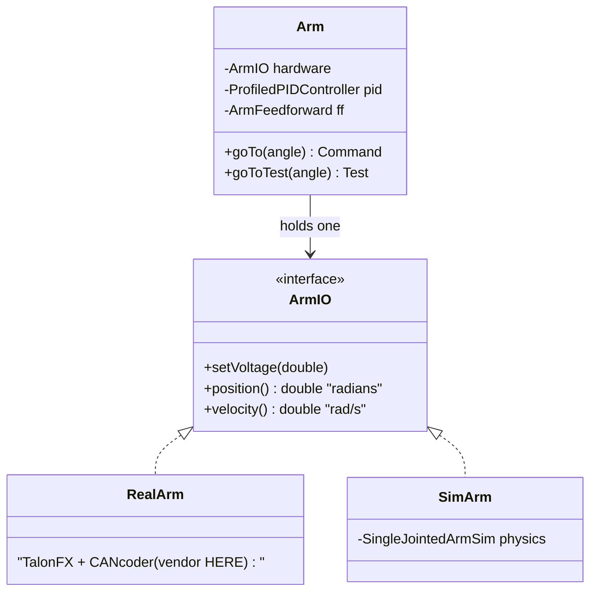

# Rotational Position Subsystems — Arm, Pivot, Wrist, Turret

> **Prereq:** read [`00-anatomy-of-a-subsystem.md`](00-anatomy-of-a-subsystem.md), then
> [`01-linear-position.md`](01-linear-position.md) — this archetype is the elevator's twin (same
> quartet, same loop-above recommendation, same test shape), so this doc focuses on what *differs*.
>
> *Code is quoted to study the technique, not to copy. Build the contract for **your** mechanism.*

---

## 1. What it does

A **rotational position mechanism** drives a joint to a commanded **angle** and holds it. The
robot has one wherever something *rotates* to setpoints: an **arm** or **pivot** (a shoulder), a
**wrist** (a second joint at the end of an arm), or a **turret** (continuous yaw rotation). The job
is "go to angle θ and hold," so it is a position controller plus a gravity feedforward — the same
shape as a linear mechanism, with rotation in place of translation.

The corpus shows **14 teams** with a clean `ArmIO`+`ArmIOSim`, **13** for a pivot, fewer for wrist
and turret — all the same archetype. Differences (gravity that varies with angle, an absolute
encoder, turret wrap-around) live in §2 and §5.

## 2. How it operates — the control archetype

### 2.1 The control truth (and the two things that make it harder than an elevator)
State is **angle** (radians) and **angular velocity** (rad/s); control is profiled PID +
feedforward. Two differences from the linear case:

- **Gravity is angle-dependent.** An elevator's `kG` is constant; an arm's gravity torque scales
  with `cos(θ)` (max horizontal, zero vertical). Use `ArmFeedforward` (which takes the angle), not
  `ElevatorFeedforward`.
- **Absolute position matters.** You can't reliably home an arm to a hard stop. Real arms use an
  **absolute encoder** (a CANcoder/through-bore) so the joint knows its true angle on boot — the
  rotational subsystem's signature hardware detail.

### 2.2 Where the loop lives
Same choice as §01 §2.2; same recommendation: **loop above the line** (`setVoltage` + angle
getters) for anything you simulate, so Sim and Real share one controller. SciBorgs builds Arm this
way; AdvantageKit teams (5026, 2910) push it below with an `@AutoLog` inputs struct and on-motor
control.

### 2.3 The sim model
WPILib **`SingleJointedArmSim`** — a pendulum on a motor+gearbox. It needs the arm's **moment of
inertia** and length, which are harder to estimate than an elevator's mass; a wrong MOI is the
usual reason a rotational sim test won't settle (see §6.1).



## 3. The contract — `ArmIO`

### 3.1 The interface
| Method | Crosses as | Why |
|---|---|---|
| `setVoltage(double v)` | command | the only actuation; subsystem computes `v` from PID + `ArmFeedforward(θ)` |
| `position()` → radians | sensor | feedback; **must read the absolute encoder**, not a relative count |
| `velocity()` → rad/s | sensor | feedforward / settling |

Three methods — even smaller than the elevator's, because a rotational joint rarely needs an
explicit `resetPosition()` when it has an absolute encoder. The loop-below variant replaces
`setVoltage` with `setAngle(rad)` / `runSetpoint(...)`.

### 3.2 The inputs (struct form)
Same fields as linear, with angle in radians: `positionRad`, `velocityRadPerSec`, `appliedVolts`,
`currentAmps`, `tempCelsius`, `absoluteEncoderConnected`. Add `absolutePositionRad` separately when
the absolute and motor encoders are distinct sensors.

### 3.3 What it omits
No `TalonFX`/`CANcoder` type, no "which scoring level" logic, no other subsystem.

## 4. Real implementations from the corpus

SciBorgs (1155) Reefscape 2025 again gives the cleanest full quartet.

### 4.1 The interface
*1155 SciBorgs — `Reefscape-2025/.../robot/arm/ArmIO.java`*
```java
public interface ArmIO extends AutoCloseable {
  /** @return The position in radians. */
  public double position();
  /** @return The position in radians/sec. */
  public double velocity();
  /** Sets the voltage of the arm motor. */
  public void setVoltage(double voltage);
}
```

### 4.2 The hardware impl — vendor + the absolute encoder, confined
*1155 SciBorgs — `Reefscape-2025/.../robot/arm/RealArm.java`*
```java
import com.ctre.phoenix6.hardware.TalonFX;              // ◀ vendor — only here
import com.ctre.phoenix6.signals.FeedbackSensorSourceValue;
// ...
public class RealArm implements ArmIO {
  private final TalonFX leader;
  public RealArm() {
    leader = new TalonFX(ARM_PIVOT, CANIVORE_NAME);
    config.Feedback.FeedbackSensorSource = FeedbackSensorSourceValue.RemoteCANcoder; // absolute angle
    config.Feedback.FeedbackRemoteSensorID = CANCODER;
    // ...current limits, brake mode...
    leader.getConfigurator().apply(config);
  }
  @Override public double position() { return leader.getPosition().getValue().in(Radians); }
  @Override public double velocity() { return leader.getVelocity().getValue().in(RadiansPerSecond); }
  @Override public void setVoltage(double voltage) { leader.setVoltage(voltage); }
}
```
The CANcoder is fused into the TalonFX as a `RemoteCANcoder` feedback source — all of it inside the
real impl, so "we switched to a through-bore on a SparkMax" is one new file. (A stray, unused
`import com.revrobotics.spark.SparkMax;` lingers in this file — harmless, but the kind of thing the
import-lint rule in §6.3 catches.)

### 4.3 The simulation impl — the only line that changes from the elevator
*1155 SciBorgs — `Reefscape-2025/.../robot/arm/SimArm.java`*
```java
public class SimArm implements ArmIO {
  private final SingleJointedArmSim sim =
      new SingleJointedArmSim(
          GEARBOX, GEARING, MOI, ARM_LENGTH.in(Meters),
          MIN_ANGLE.in(Radians), MAX_ANGLE.in(Radians), true, DEFAULT_ANGLE.in(Radians));

  @Override public double position() { return sim.getAngleRads(); }
  @Override public double velocity() { return sim.getVelocityRadPerSec(); }
  @Override public void setVoltage(double voltage) {
    sim.setInputVoltage(voltage);
    sim.update(Constants.PERIOD.in(Seconds));
  }
}
```
Swap `ElevatorSim` for `SingleJointedArmSim` and meters for radians — the rest of the archetype is
identical.

### 4.4 The subsystem
Structurally the elevator's twin: holds one `ArmIO`, owns a `ProfiledPIDController` +
`ArmFeedforward`, a `create()` selection point, and a `goToTest(angle)` system check — see
[`01-linear-position.md`](01-linear-position.md) §4.4 for the full shape. The one change is the
feedforward: `ArmFeedforward.calculate(angleRad, velocity)` so the gravity term tracks `cos(θ)`.

## 5. Variations across teams

| Mechanism | Team | How it differs | Reference |
|---|---|---|---|
| Pivot (shoulder) | 1155 | identical to Arm; separate `PivotIO`/`RealPivot`/`SimPivot`/`NoPivot` package | `Crescendo-2024/.../robot/pivot/PivotIO.java` |
| `@AutoLog` + loop-below | 5026, 2910 | `ArmIOInputs` struct, on-motor control, `setAngle`/`runSetpoint` contract | DB: `ArmIO` interfaces of 5026, 2910 |
| Wrist (second joint) | 6328 | same archetype mounted on the arm; its zero is *relative to the arm*, so its feedforward needs the arm angle too | DB: `WristIO` |
| **Turret** (continuous yaw) | 2706, 254 | the wrap-around case: no gravity term, but angle is **continuous** — use `MathUtil.angleModulus` / a continuous-input PID so it takes the short way around; full `TurretIO`/`TurretIOSim`/`TurretIOTalonFX` triad | DB: `TurretIO` of 2706, 254 |

The big archetype split is gravity vs. no-gravity: arm/pivot/wrist need `ArmFeedforward`; a turret
(horizontal axis) needs none but must handle angle wrap-around.

## 6. The governing ethic, applied to a rotational subsystem

### 6.1 Mock below, test above — and a real caution
The test is the elevator's shape — construct the subsystem on `SimArm`, command angles, assert it
arrives:

*1155 SciBorgs — `Reefscape-2025/src/test/java/.../robot/ArmTest.java`*
```java
@Disabled // "Doesn't work :/"  ◀ honest, and instructive
public class ArmTest {
  Arm arm;
  @BeforeEach public void setup() { setupTests(); arm = Arm.create(); }

  @Test public void fullExtension() {
    runUnitTest(arm.goToTest(MIN_ANGLE));
    runUnitTest(arm.goToTest(MAX_ANGLE));
  }
  @RepeatedTest(5) public void randExtension() {
    runUnitTest(arm.goToTest(Radians.of(Math.random() * range).plus(MIN_ANGLE)));
  }
}
```
SciBorgs **disabled** this test — the honest lesson of the rotational archetype. A sim test is only
as good as its physics constants, and an arm's **moment of inertia** is hard to estimate; if the
MOI or `ArmFeedforward` gains are off, the sim arm overshoots or never settles inside the tolerance
and the test flakes. The fix is not to delete the test but to measure MOI (CAD or a pendulum swing)
and tune the sim — at which point you have a real regression test *and* a validated feedforward.
The pattern (`new Arm(new SimArm())`, command, assert) is correct; the discipline is in the
constants.

### 6.2 Rip it out as a library
The `arm/` package imports WPILib + its own constants/ports and **no sibling subsystem**. The arm
neither knows nor cares that a wrist or an elevator exists; coordination (don't swing the arm into
the elevator) lives in the `Superstructure`, not here — which is exactly why the arm package is
liftable on its own.

### 6.3 Vendor discipline
> **Banned above the line:** `com.ctre.*`, `com.revrobotics.*`, the CANcoder/through-bore SDK
> types. They live only in `RealArm` (§4.2). Allowed: `edu.wpi.first.*`.

`RealArm` confines `com.ctre` correctly — even the absolute-encoder configuration stays inside it,
so the subsystem above the line works in radians and never sees a `RemoteCANcoder`. The lingering
unused `com.revrobotics` import is exactly what a checkstyle/spotless unused-import + banned-import
rule should flag.

## 7. Checklist — is your rotational subsystem intact?

- [ ] An `ArmIO` with `setVoltage` + `position()`(radians)/`velocity()` and **no vendor type**.
- [ ] `position()` reads an **absolute** encoder, so the joint boots knowing its angle.
- [ ] A `SimArm` wraps `SingleJointedArmSim` with a **measured** MOI, not a guess.
- [ ] The subsystem uses `ArmFeedforward` (gravity tracks `cos θ`), not a constant `kG`.
- [ ] A `RealArm` is the only file importing `com.ctre`/`com.revrobotics`.
- [ ] A test constructs the subsystem on `SimArm` and asserts it reaches commanded angles (and if
      it's disabled, the reason is a known sim-constant gap, written down).
- [ ] (Turret) angle is treated as continuous (wrap-around handled); no gravity feedforward.
