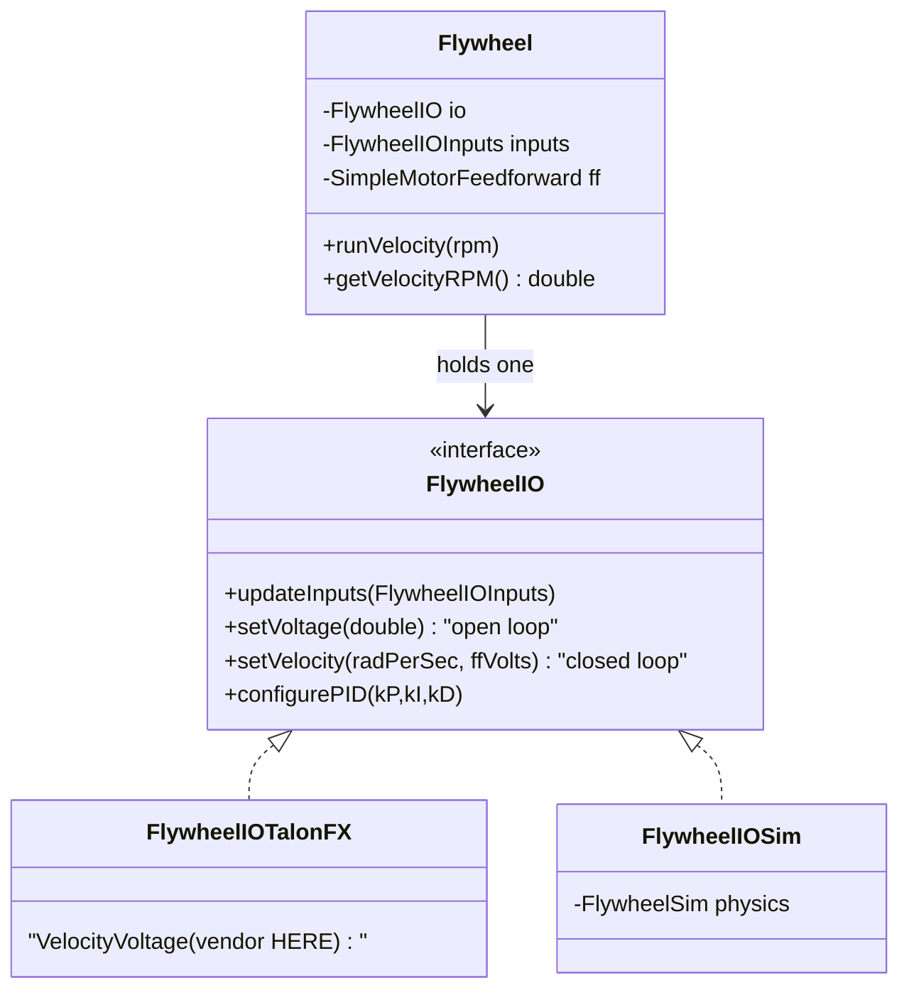

# Velocity Subsystems — Shooter, Flywheel

> **Prereq:** [`00-anatomy-of-a-subsystem.md`](00-anatomy-of-a-subsystem.md), then skim
> [`01-linear-position.md`](01-linear-position.md). This archetype is the same quartet with the
> controlled variable changed from **position to speed** — there is no setpoint to hold against
> gravity, only a target velocity to reach and stay at.
>
> *Code is quoted to study the technique, not to copy. Build the contract for **your** mechanism.*

---

## 1. What it does

A **velocity mechanism** spins a wheel up to a commanded **speed** and holds it there while energy
is drawn off (a game piece launched, a roller fed). The robot has one wherever a **flywheel** or
**shooter** must reach an RPM before it acts. The job is "get to ω rad/s and stay within tolerance,"
so the whole subsystem is a velocity controller with a `kV` feedforward — no position, no gravity.

**14 teams** ship a `ShooterIO`+sim, **9** a `FlywheelIO`+sim. The single most-forked example in
the corpus is the 6328 AdvantageKit flywheel template (it appears, copied, inside many teams' repos
including 5712).

## 2. How it operates — the control archetype

### 2.1 The control truth
State is **angular velocity** (rad/s). Control is feedback on velocity + a `kS`/`kV` feedforward
(`SimpleMotorFeedforward`) — *not* `ElevatorFeedforward`/`ArmFeedforward`, because there is no
gravity term. The defining property is the **"at speed" tolerance**: you act (shoot/feed) only when
`|ω − ωₜ| < tolerance`, so the subsystem exposes an `atSetpoint()`/velocity reading the coordinator
polls.

### 2.2 Where the loop lives
Velocity loops run cleanly **on the motor** (Phoenix 6 `VelocityVoltage`, Spark closed-loop), so the
common contract is a hybrid: the subsystem computes the **feedforward** and hands it down with the
target — `setVelocity(velocityRadPerSec, ffVolts)` — and the impl runs the velocity **PID**. This is
loop-below for the feedback, loop-above for the feedforward, and it keeps Sim/Real in parity because
both consume the same `ffVolts`.

### 2.3 The sim model
WPILib **`FlywheelSim`** — a motor driving a pure inertia (no gravity, no end stops). It models the
one thing that matters here: **spin-up time** (the exponential approach to target ω, set by the
wheel's moment of inertia). A shooter sim that ignores this would let you "shoot" instantly; the
real one makes you wait for the wheel.



## 3. The contract — `FlywheelIO`

### 3.1 The interface
| Method | Crosses as | Why |
|---|---|---|
| `setVoltage(double v)` | command | open-loop spin-up / characterization |
| `setVelocity(radPerSec, ffVolts)` | command | closed-loop target; subsystem supplies the feedforward |
| `stop()` | command | coast down |
| `configurePID(kP,kI,kD)` | config | the velocity loop runs on the motor, so gains live below the line |
| `updateInputs(inputs)` | input | fills the `@AutoLog` struct |

### 3.2 The inputs struct
*From the 6328 AdvantageKit template — the velocity reading is the whole point:*
```java
@AutoLog
public static class FlywheelIOInputs {
  public double positionRad = 0.0;
  public double velocityRadPerSec = 0.0;   // ◀ the controlled variable
  public double appliedVolts = 0.0;
  public double[] currentAmps = new double[] {};
}
```

### 3.3 What it omits
No motor type, no "is a note loaded," no pivot/hood angle (that's a *separate* rotational
subsystem — see §5).

## 4. Real implementations from the corpus

The 6328 AdvantageKit flywheel template (here in 5712's repo, where it's been forked verbatim) is
the reference; it is the cleanest inputs-struct velocity contract in the corpus.

### 4.1 The interface
*5712 Hemlock — `2024-Eos/.../subsystems/flywheel/FlywheelIO.java` (6328 AdvantageKit template)*
```java
public interface FlywheelIO {
  @AutoLog
  public static class FlywheelIOInputs { /* velocityRadPerSec, appliedVolts, currentAmps */ }

  public default void updateInputs(FlywheelIOInputs inputs) {}
  public default void setVoltage(double volts) {}                              // open loop
  public default void setVelocity(double velocityRadPerSec, double ffVolts) {} // closed loop
  public default void stop() {}
  public default void configurePID(double kP, double kI, double kD) {}
}
```

### 4.2 The hardware impl
Not quoted in full here (the device impl follows the same shape as `RealElevator`/`RealArm` in
§01/§02 — a `TalonFX`/`SparkMax` confined to one file). The velocity-specific detail: the impl maps
`setVelocity` onto an **on-motor velocity request** (Phoenix 6 `VelocityVoltage(ω).withFeedForward(ffVolts)`)
so the closed loop runs at 1 kHz on the controller, not in the 50 Hz robot loop. `com.ctre` /
`com.revrobotics` appears here and nowhere above.

### 4.3 The simulation impl — models spin-up
*5712 Hemlock — `2024-Eos/.../subsystems/flywheel/FlywheelIOSim.java`*
```java
public class FlywheelIOSim implements FlywheelIO {
  private FlywheelSim sim = new FlywheelSim(DCMotor.getNEO(1), 1.5, 0.004); // gearing, MOI
  private PIDController pid = new PIDController(0.0, 0.0, 0.0);
  private boolean closedLoop = false;
  private double ffVolts = 0.0;

  @Override public void updateInputs(FlywheelIOInputs inputs) {
    if (closedLoop)
      sim.setInputVoltage(MathUtil.clamp(pid.calculate(sim.getAngularVelocityRadPerSec()) + ffVolts, -12, 12));
    sim.update(0.02);                                   // advance the inertia one tick
    inputs.velocityRadPerSec = sim.getAngularVelocityRadPerSec();
    inputs.appliedVolts = appliedVolts;
  }
  @Override public void setVelocity(double velocityRadPerSec, double ffVolts) {
    closedLoop = true; pid.setSetpoint(velocityRadPerSec); this.ffVolts = ffVolts;
  }
  // setVoltage(), stop(), configurePID() ...
}
```
The Sim runs the *same* velocity PID the real motor would, fed the *same* `ffVolts` the subsystem
computes — so a shooter that "gets to speed" in sim gets to speed on the robot.

### 4.4 The subsystem — and the "sim is a separate robot" idea
*5712 Hemlock — `2024-Eos/.../subsystems/flywheel/Flywheel.java`*
```java
public class Flywheel extends SubsystemBase {
  private final FlywheelIO io;
  private final FlywheelIOInputsAutoLogged inputs = new FlywheelIOInputsAutoLogged();
  private final SimpleMotorFeedforward ffModel;

  public Flywheel(FlywheelIO io) {
    this.io = io;
    switch (Constants.currentMode) {           // ◀ different feedforward gains per mode
      case REAL, REPLAY -> { ffModel = new SimpleMotorFeedforward(0.1, 0.05); io.configurePID(1.0,0,0); }
      case SIM          -> { ffModel = new SimpleMotorFeedforward(0.0, 0.03); io.configurePID(0.5,0,0); }
    }
  }
  @Override public void periodic() { io.updateInputs(inputs); Logger.processInputs("Flywheel", inputs); }

  public void runVelocity(double velocityRPM) {
    var radPerSec = Units.rotationsPerMinuteToRadiansPerSecond(velocityRPM);
    io.setVelocity(radPerSec, ffModel.calculate(radPerSec));   // subsystem owns the feedforward
  }
  @AutoLogOutput public double getVelocityRPM() { return Units.radiansPerSecondToRotationsPerMinute(inputs.velocityRadPerSec); }
}
```
Note the comment in the source — *"the physics simulator is treated as a separate robot with
different tuning."* That is the AdvantageKit mindset: Sim and Real are two implementations behind one
contract, each with its own constants, both exercised by the same code.

## 5. Variations across teams

| Variation | Team | How it differs | Reference |
|---|---|---|---|
| Shooter = flywheel + hood/feeder | 2706 | `ShooterIO` for the wheels, a *separate* rotational `PivotIO`/hood and a `FeederIO` (a roller — see `04`); a `Shooting` command coordinates them | `RobotCode2024-Forte/.../subsystems/shooter/ShooterIO.java` |
| Plain-getter velocity | 1155 | no inputs struct; `ShooterIO` exposes `setVoltage` + `velocity()`, subsystem runs the PID above the line (loop-above) | `Crescendo-2024/.../robot/shooter/` |
| Dual-wheel / spin | many | top & bottom (or left & right) wheels at different speeds for backspin — two `setVelocity` targets, often two IO instances | DB: `Shooter*` |

The recurring design point: a "shooter" is usually **two archetypes** — a velocity flywheel (this
doc) plus a rotational hood/pivot (`02`) plus a roller feeder (`04`). Keep them as separate
subsystems behind separate IO contracts and let a command compose them; don't fuse them into one
class.

## 6. The governing ethic, applied to a velocity subsystem

### 6.1 Mock below, test above
The velocity test asserts the wheel **reaches and holds** a commanded speed within tolerance — the
RPM analog of the elevator reaching a height. SciBorgs' shooting test, abridged:

*1155 SciBorgs — `Crescendo-2024/src/test/java/.../robot/ShootingTest.java`*
```java
@BeforeEach public void setup() {
  setupTests();
  shooter = Shooter.create();  pivot = Pivot.create();  feeder = Feeder.create();  drive = Drive.create();
  shooting = new Shooting(shooter, pivot, feeder, drive);   // ◀ whole flow, all on sim
}

@ParameterizedTest @ValueSource(doubles = {200, 300, 350, 400, 500, 540})
public void shootSysCheck(double v) { runUnitTest(shooter.goToTest(RadiansPerSecond.of(v))); }

@ParameterizedTest @ValueSource(doubles = {-200, -100, 0, 100, 200})
public void testShootStoredNote(double vel) {
  run(shooting.shoot(RadiansPerSecond.of(vel)));
  fastForward();
  assertEquals(vel, shooter.rotationalVelocity(), VELOCITY_TOLERANCE.in(RadiansPerSecond)); // ◀ at speed?
}
```
Two things to take from this. First, `shootSysCheck` is the per-subsystem velocity check (reaches ω
within tolerance). Second — and this is the real prize — `testShootStoredNote` constructs **four
subsystems on sim and the command that coordinates them** and asserts the end state. Because every
subsystem mocks its hardware below, a whole behavior is testable with no robot. That only works if
none of the four imports another: the composition lives in the `Shooting` command, not inside the
shooter.

### 6.2 Rip it out as a library
`flywheel/` imports WPILib + AdvantageKit's `Logger` + its own constants — no sibling subsystem. The
6328 template *is* distributed as a copy-paste module precisely because it has no outward
dependencies; that is the library test passing.

### 6.3 Vendor discipline
> **Banned above the line:** `com.ctre.*` / `com.revrobotics.*`. The on-motor `VelocityVoltage`
> request lives only in the `*IOTalonFX`/`*IOSparkMax` impl (§4.2). Allowed: `edu.wpi.first.*` and
> the logging facade (`org.littletonrobotics.junction`).

The hybrid loop (feedforward above, PID below) is where this discipline is most often broken — teams
reach for a `TalonFX` velocity API in the subsystem to "just set the RPM." Keep the subsystem in
rad/s and `ffVolts`; let the impl translate.

## 7. Checklist — is your velocity subsystem intact?

- [ ] A `FlywheelIO`/`ShooterIO` with `setVelocity(radPerSec, ffVolts)` (+ `setVoltage` for
      characterization) and an inputs struct carrying `velocityRadPerSec`.
- [ ] A `FlywheelIOSim` wrapping `FlywheelSim` with a real moment of inertia (so spin-up is realistic).
- [ ] The subsystem owns a `SimpleMotorFeedforward` (kS/kV) — no gravity term.
- [ ] An `atSetpoint()`/velocity reading the coordinator polls before it acts ("at speed").
- [ ] The on-motor velocity request (`VelocityVoltage`/Spark closed-loop) is confined to the device impl.
- [ ] A test asserts the wheel reaches a commanded RPM within tolerance on `FlywheelIOSim`.
- [ ] A "shooter" is split into flywheel (here) + hood (`02`) + feeder (`04`), composed by a command.
