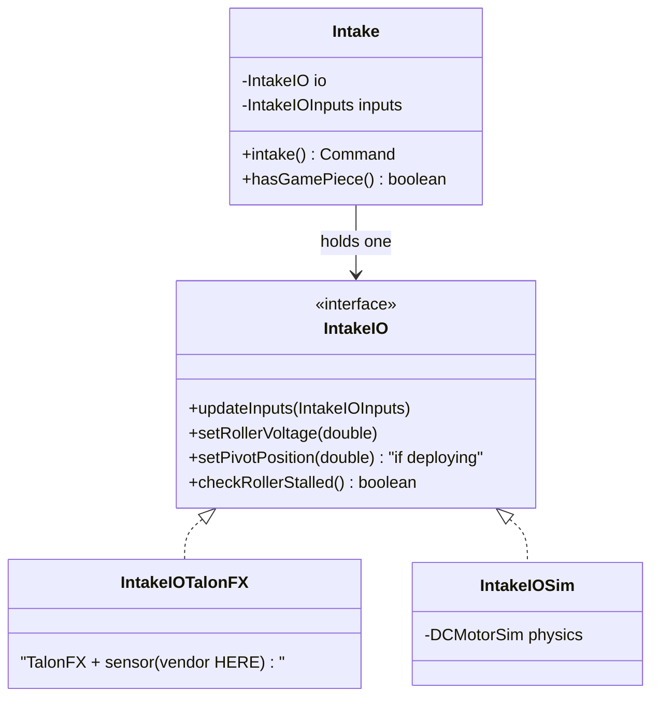

# Roller / Game-Piece Subsystems — Intake, Indexer, Feeder, Manipulator

> **Prereq:** [`00-anatomy-of-a-subsystem.md`](00-anatomy-of-a-subsystem.md). This is the simplest
> *actuator* archetype (often just "spin a wheel") with the most interesting *sensor*: the thing
> that tells you whether you have the game piece.
>
> *Code is quoted to study the technique, not to copy. Build the contract for **your** mechanism.*

---

## 1. What it does

A **roller / game-piece subsystem** moves a game piece *through* the robot: an **intake** pulls it
in, an **indexer**/**feeder** moves it to the shooter, a **manipulator**/**claw** holds or ejects
it. The actuation is trivial — run a wheel at a voltage or speed. The hard, defining part is the
**sensor that answers "do we have it?"** — a beam-break, a distance sensor, or motor-stall current.
A roller subsystem is therefore less about control and more about **detecting state transitions**
(empty → holding → ejected).

This is the most common subsystem family in the corpus (**18 teams** with a clean `IntakeIO`+sim),
because almost every game has a piece to handle.

## 2. How it operates — the control archetype

### 2.1 The control truth
Actuation is open-loop **voltage** (`run(+6V)` / `stop`) or a simple velocity — a `DCMotorSim`
suffices; there is no position to hold, no gravity. The **state** is the game-piece sensor, and the
subsystem's real job is to expose it (`hasGamePiece()`) so commands can do "intake **until** we have
a piece, then stop."

### 2.2 Two sub-shapes
- **Fixed roller** (indexer, feeder, fixed intake): one motor + a sensor. Pure this archetype.
- **Deploying intake**: a roller **plus a pivot** that lowers/raises it. That's this archetype
  fused with a rotational one ([`02`](02-rotational-position.md)) — the `IO` carries *both*
  `setRollerVoltage` and `setPivotPosition`. Keep them as one IO only if they're one mechanism;
  otherwise split.

### 2.3 The sim model
WPILib **`DCMotorSim`** for the roller (and pivot). But the model that *matters* is the **sensor**:
to test "intake until we have a piece," the Sim impl must be able to **report the beam-break as
tripped on command**. Most teams skip this, which is why rollers are the least-tested archetype
(§6.1).



## 3. The contract — `IntakeIO`

### 3.1 The interface
| Method | Crosses as | Why |
|---|---|---|
| `setRollerVoltage(double v)` | command | run/reverse/stop the roller |
| `setPivotPosition(double rot)` | command | *(deploying intakes only)* lower/raise |
| `updateInputs(inputs)` | input | fills the struct — crucially the **sensor** |
| `checkRollerStalled()` / sensor input | input | the "have piece?" signal |

### 3.2 The inputs — the sensor is the point
A roller's inputs carry the usual motor telemetry **plus a game-piece sensor**. 3476 models it as a
CANRange distance sensor with a `tripped` flag (and a stall check as backup):
```java
record RollerData(boolean isMotorConnected, double voltage, double supplyCurrent,
                  double statorCurrent, double temperature, double velocityRPS) {}
record CanRangeData(boolean isSensorConnected, boolean tripped,   // ◀ "do we have a piece?"
                    double signalStrength, double distanceMeters) {}
```
Other teams use a `boolean beamBroken` (digital beam-break) or `checkRollerStalled()` (current
spike when a piece jams the wheel). Whatever the hardware, **the sensor crosses the IO line as a
boolean/double input** — so sim can fake it.

### 3.3 What it omits
No motor type, no "should we be intaking right now" (that's the command/superstructure), no shooter.

## 4. Real implementations from the corpus

### 4.1 The generic-roller move (6328) — the D1-level-4 variation
6328 noticed every roller is the same and extracted a base; the intake is then a one-line tag:
*6328 Mechanical Advantage — `RobotCode2024Public/.../subsystems/rollers/intake/IntakeIO.java`*
```java
public interface IntakeIO extends GenericRollerSystemIO {}
```
`GenericRollerSystemIO` carries `updateInputs` + `runVolts` + `stop`; `Intake`, `Feeder`, `Indexer`
are all `GenericRollerSystem`s differing only by constants. This is "generalize after the third
copy" (rubric D1 L4) applied to the most-repeated subsystem.

### 4.2 The rich intake (3476) — roller + pivot + sensor in one IO
*3476 Code Orange — `Godzilla-ReefScapeOffseason/.../subsystems/intake/IntakeIO.java`*
```java
public interface IntakeIO {
  @AutoLog
  class IntakeIOInputs {
    public PivotData pivotData;        // the deploy joint (a rotational mechanism)
    public RollerData rollerData;      // the wheel
    public CanRangeData canRangeData;  // the game-piece sensor
  }
  default void setPivotVoltage(double voltage) {}
  default void setRollerVoltage(double voltage) {}
  default void setPivotPosition(double positionRotations) {}
  default boolean checkRollerStalled() { return false; }   // backup "have piece" via current
}
```
A deploying intake is two archetypes behind one contract — note `setPivotPosition` is the rotational
mechanism from [`02`](02-rotational-position.md), riding alongside the roller.

### 4.3 The simulation impl — `DCMotorSim`, and a vendor nuance
*3476 Code Orange — `.../subsystems/intake/IntakeIOSim.java`*
```java
import com.ctre.phoenix6.sim.TalonFXSimState;   // ◀ a vendor type — allowed, this is BELOW the line
import edu.wpi.first.wpilibj.simulation.DCMotorSim;

public class IntakeIOSim extends IntakeIOReal {
  protected DCMotorSim rollerSim, pivotSim;
  // a Notifier ticks the DCMotorSim at 200 Hz; the TalonFXSimState feeds applied voltage back in
  // so the *real* TalonFX control code runs against simulated physics.
}
```
Two things here. First, `DCMotorSim` is the roller's physics. Second — a useful nuance for §6.3 —
this Sim impl imports `com.ctre.phoenix6.sim`. That's **fine**: both `IOReal` and `IOSim` are *below*
the line, so a vendor type is allowed in either. 3476 uses CTRE's sim-state (the controller
simulates itself, high fidelity, tied to CTRE); SciBorgs keeps `SimElevator` pure WPILib (more
portable). Both are valid — the rule is "no vendor *above* the line," not "no vendor in sim."

## 5. Variations across teams

| Variation | Team | How it differs | Reference |
|---|---|---|---|
| Generic roller base | 6328 | one `GenericRollerSystemIO` shared by intake/feeder/indexer | `RobotCode2024Public/.../rollers/` |
| Roller + pivot + CANRange | 3476 | deploying intake; distance sensor `tripped` is the have-piece flag | `Godzilla-ReefScapeOffseason/.../intake/IntakeIO.java` |
| Stall-current detection | 3476, many | no beam-break — `checkRollerStalled()` infers a held piece from current | `.../intake/IntakeIO.java` |
| Indexer / Feeder | 2706, 1155 | fixed roller + a beam-break; no pivot — the purest form of this archetype | DB: `FeederIO`, `IndexerIO` |
| Manipulator / Claw | 3636, 3061 | a roller *or* a servo-gripper that holds; "have piece" via a sensor or position | DB: `ManipulatorIO` |

## 6. The governing ethic, applied to a roller subsystem

### 6.1 Mock below, test above — and the archetype's honest weak spot
Here is the uncomfortable truth this archetype teaches. SciBorgs — the corpus testing leader —
tests its elevator and shooter with real behavior assertions, but its `IntakeTest` is only:

*1155 SciBorgs — `Crescendo-2024/src/test/java/.../robot/IntakeTest.java`*
```java
public class IntakeTest {
  @Test public void init() throws Exception {
    Intake.create().close();   // ◀ a construction smoke-test, no behavior asserted
    reset();
  }
}
```
Why? Because the *interesting* behavior — "run the roller **until the beam-break trips**, then
stop" — needs the **sensor** simulated, and faking a beam-break is more work than wrapping a
`DCMotorSim`. So teams test that the subsystem constructs and stop there.

**The build-spec fix is small and high-value:** make the game-piece sensor a plain IO input (a
`boolean beamBroken` in the inputs struct) and give `IntakeIOSim` a way to set it
(`sim.setBeamBroken(true)`). Then the real test becomes possible:
```java
// the test this archetype should have:
var intake = new Intake(simIO);
run(intake.intakeUntilHeld());     // command runs the roller
simIO.setBeamBroken(true);         // fake the piece arriving
fastForward();
assert intake.hasGamePiece();      // and assert the command reacted
```
That is the whole payoff of putting the sensor *behind the IO line* instead of reading a
`DigitalInput` directly in the subsystem.

### 6.2 Rip it out as a library
A roller package imports WPILib + its own constants — nothing else. 6328's `GenericRollerSystem`
*is* a mini-library three subsystems consume. The only thing that ties a roller to the rest of the
robot is the sensor's meaning ("a coral is held"), and that interpretation lives in the command, not
the subsystem.

### 6.3 Vendor discipline
> **Banned above the line:** `com.ctre.*`/`com.revrobotics.*` in the subsystem/command. **Allowed
> below the line in *both* `IOReal` and `IOSim`** — 3476's `IntakeIOSim` legitimately uses
> `com.ctre.phoenix6.sim`. Allowed everywhere: `edu.wpi.first.*`.

The leak to watch on rollers: reading a `DigitalInput` beam-break *in the subsystem* is fine (it's
WPILib), but reading a CTRE CANrange or a SparkMax limit switch in the subsystem is a vendor leak —
route it through the inputs struct.

## 7. Checklist — is your roller subsystem intact?

- [ ] An `IntakeIO` with `setRollerVoltage`/`run` + `stop` and the **game-piece sensor as an input**
      (`beamBroken`/`tripped`/`checkRollerStalled`) — not read directly in the subsystem.
- [ ] An `IntakeIOSim` wrapping `DCMotorSim` **and** able to fake the sensor on command.
- [ ] `hasGamePiece()` exposed for commands to gate on.
- [ ] A deploying intake's pivot is the rotational archetype (`02`) carried in the same IO, not a
      hand-rolled angle loop.
- [ ] A test runs the intake command and asserts it reacts to a faked sensor trip (not just that it
      constructs).
- [ ] Vendor types confined below the line (subsystem reads only the struct + WPILib `DigitalInput`).
