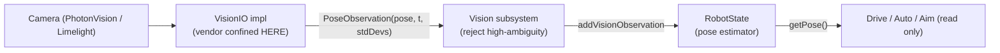

# Vision — the Sensor-Only Subsystem

> **Prereq:** [`00-anatomy-of-a-subsystem.md`](00-anatomy-of-a-subsystem.md), and ideally
> `../elite-architecture.md` §2.4 (the `RobotState` seam) and §5.A. Vision is the archetype that
> **breaks the mold**: there is no motor, no setpoint, no control loop. The IO is a pure **sensor**
> that *produces observations*, and the subsystem's only job is to feed them to `RobotState`.
>
> *Code is quoted to study the technique, not to copy. Build the contract for **your** mechanism.*

---

## 1. What it does

A **vision subsystem** turns what the cameras see (AprilTags) into a correction to the robot's
belief about where it is. It **actuates nothing**. It reads camera frames, computes a field-relative
pose estimate with a timestamp and a confidence, and hands that to `RobotState`, which fuses it with
wheel odometry. Everything downstream — auto, pathing, aiming — reads the *fused* pose from
`RobotState` and never talks to the camera. This is why vision is a subsystem at all: it owns the
camera hardware behind an IO seam so the rest of the robot stays vendor-agnostic.

**50 of 55 teams** call `addVisionMeasurement` — vision is assumed. The interesting differences are
*where* pose estimation runs and *how* bad observations are rejected (§5).

## 2. How it operates — the sensor archetype

### 2.1 The data flow (there is no control loop)
```
Camera → VisionIO.updateInputs(observations) → Vision subsystem (filter by ambiguity / std-dev)
       → RobotState.addVisionObservation(pose, timestamp, stdDevs) → pose estimator fuses with odometry
```
The defining rule (from `elite-architecture.md` §5.A): **vision never talks to drive.** It writes a
measurement to `RobotState`; drive, auto, and aiming all read pose *from* `RobotState`. Swapping
PhotonVision for Limelight is a new `VisionIO` impl and touches nothing else.

### 2.2 The two architectures
- **Estimate on the RIO** (3061): the IO impl runs a `PhotonPoseEstimator` and emits a `Pose2d`
  observation. Simple, all in robot code.
- **Estimate on a coprocessor** (6328 "Northstar", Limelight MegaTag): the coprocessor computes the
  pose; the IO just receives frames/poses over NetworkTables. Less RIO load, more infrastructure.

### 2.3 "Sim" for a sensor
There's no physics model. Sim means **producing fake observations**: WPILib's `PhotonCameraSim`
renders tags from a simulated field pose, or you replay logged frames. The test feeds a known
observation and checks the fused pose responds correctly (§6.1).



## 3. The contract — `VisionIO`

### 3.1 The interface — note what's missing
| Method | Crosses as | Why |
|---|---|---|
| `updateInputs(inputs)` | **input only** | fills the observation struct (poses, timestamps, tags seen, fps) |
| `setPipeline(int)` / `setRecording(bool)` | config | camera configuration — **not robot actuation** |

There is **no `setVoltage`, no `setSetpoint`** — the absence is the archetype. A `VisionIO` that
exposed an actuation method would be a category error.

### 3.2 The observation struct
The inputs carry the *evidence*, not a single answer: per-frame timestamp, the estimated pose(s),
which tags were used, and the **ambiguity / average tag distance** that downstream code turns into a
standard-deviation weight. 6328 logs raw frames; 3061 logs computed `PoseObservation`s with
`averageAmbiguity` and `averageTagDistance` so the subsystem can reject or downweight bad frames.

### 3.3 What it omits
No `PhotonCamera`/`LimelightHelpers` type, no drivetrain reference, no game logic — and no
actuation.

## 4. Real implementations from the corpus

### 4.1 The interface — sensor-only, observations out
*6328 Mechanical Advantage — `RobotCode2025Public/.../subsystems/vision/VisionIO.java`*
```java
public interface VisionIO {
  @AutoLog class AprilTagVisionIOInputs {
    public double[] timestamps = new double[] {};
    public double[][] frames = new double[][] {};   // observations, not commands
    public long fps = 0;
  }
  default void updateInputs(VisionIOInputs inputs, AprilTagVisionIOInputs aprilTagInputs,
                            ObjDetectVisionIOInputs objDetectInputs) {}
  default void setRecording(boolean active) {}      // config, not actuation
}
```

### 4.2 The hardware impl — PhotonVision confined to one file
*3061 Huskie Robotics — `frc-software-2026/.../lib/team3061/vision/VisionIOPhotonVision.java`*
```java
import org.photonvision.PhotonCamera;            // ◀ the ONLY place a vendor vision type appears
import org.photonvision.PhotonPoseEstimator;

public class VisionIOPhotonVision implements VisionIO {
  protected final PhotonCamera camera;
  protected PhotonPoseEstimator photonEstimator;

  @Override public void updateInputs(/* ... */) {
    for (PhotonPipelineResult result : camera.getAllUnreadResults()) {
      var visionEstimate = photonEstimator.estimateCoprocMultiTagPose(result);
      // ...compute averageAmbiguity, averageTagDistance per observation,
      //    push PoseObservation(pose, timestamp, stdDevs) into the inputs...
    }
  }
}
```
`org.photonvision` lives here and nowhere else. A `VisionIOLimelight` is a sibling file with the
same contract — and the subsystem, `RobotState`, and the whole robot never change.

### 4.3 The consumer — `RobotState`, the state seam
*6328 Mechanical Advantage — `RobotCode2025Public/.../RobotState.java`*
```java
public void addVisionObservation(VisionObservation observation) { /* fuse into pose estimator */ }
public record VisionObservation(Pose2d visionPose, double timestamp, Matrix<N3, N1> stdDevs) {}
```
The Vision subsystem calls `addVisionObservation`; `RobotState` blends it with odometry by the
`stdDevs` weight. This is the seam from `elite-architecture.md` §2.4 — vision attaches here, and
*only* here.

## 5. Variations across teams

| Variation | Team | How it differs | Reference |
|---|---|---|---|
| RIO-side Photon estimation | 3061 | `PhotonPoseEstimator` inside the IO impl; emits `PoseObservation`s | `.../lib/team3061/vision/VisionIOPhotonVision.java` |
| Coprocessor estimation | 6328 | "Northstar" computes pose off-RIO; IO receives frames over NT | `RobotCode2025Public/.../vision/VisionIONorthstar.java` |
| Limelight / MegaTag | 254, many | `LimelightHelpers` + MegaTag2 pose; a `VisionIOLimelight` sibling | DB: `VisionIOLimelight` |
| Std-dev rejection (D7 L3) | 3061, 254 | weight/reject by ambiguity + tag distance before fusing | the `averageAmbiguity` math in §4.2 |
| World model (D7 L4) | 254, 6328 | a `RobotState` with time-interpolated buffers owns pose + game-piece state | `RobotState.java` |

The rubric ladder lives here: a camera that just servos to a target is D7 L1; feeding
`addVisionMeasurement` is L2; **rejecting bad observations by std-dev** is L3; a `RobotState` world
model is L4.

## 6. The governing ethic, applied to a sensor subsystem

### 6.1 Mock below, test above — for a sensor, you fake the *observation*
The test doesn't assert "reaches a setpoint"; it asserts the **fused pose responds correctly to a
known observation, and rejects a bad one**:
```java
// the shape of a vision test (against a sim/replay VisionIO):
var io = new VisionIOSim();                 // or replay logged frames
io.publishObservation(knownPose, timestamp, lowAmbiguity);
vision.periodic();                           // pushes it to RobotState
assertPoseNear(robotState.getPose(), knownPose, tol);   // fusion moved toward truth

io.publishObservation(garbagePose, timestamp, highAmbiguity);
vision.periodic();
assertPoseNear(robotState.getPose(), knownPose, tol);   // and rejected the bad frame
```
Because `VisionIO` is just a producer of observations, you can feed it scripted evidence with no
camera and no field — the same mock-below/test-above move, with "below" being the camera. (This is
also why coprocessor logs + AdvantageKit replay are so powerful for vision: a logged match *is* a
stream of real observations you can re-run.)

### 6.2 Rip it out as a library
The `vision/` package depends on WPILib + the vendor SDK (in the impl) + **one narrow interface**:
`RobotState.addVisionObservation`. That single coupling to the state seam is *intended* — vision's
whole purpose is to feed `RobotState`. Make it a method on a small interface (not a reference to the
concrete `RobotState`) and the vision package lifts out cleanly. It must **not** import `Drive` or
any other subsystem; if it does, the §5.A rule ("vision never talks to drive") has been broken.

### 6.3 Vendor discipline — vision is where it pays off most
> **Banned above the line:** `org.photonvision.*`, `LimelightHelpers`. They live only in
> `VisionIOPhotonVision` / `VisionIOLimelight`. Allowed above the line: WPILib geometry
> (`Pose2d`, `Transform3d`) and your observation record.

Vision is the cleanest argument for the whole discipline: PhotonVision vs Limelight is a *real*
mid-season decision teams make, and a clean `VisionIO` makes it a one-file swap. A team that calls
`LimelightHelpers.getBotPose()` directly in their drivetrain has welded themselves to Limelight —
exactly the leak to avoid.

## 7. Checklist — is your vision subsystem intact?

- [ ] A `VisionIO` whose methods are `updateInputs(...)` + camera config — **no actuation method**.
- [ ] Observations carry timestamp + pose + **ambiguity/tag-distance** (so you can weight them).
- [ ] The impl (`VisionIOPhotonVision`/`VisionIOLimelight`) is the **only** file importing
      `org.photonvision`/`LimelightHelpers`.
- [ ] Vision feeds `RobotState.addVisionObservation` and **never references the drivetrain**.
- [ ] High-ambiguity / far-tag observations are rejected or downweighted before fusing (D7 L3).
- [ ] A test publishes a known observation and asserts the fused pose responds (and rejects a bad one).
