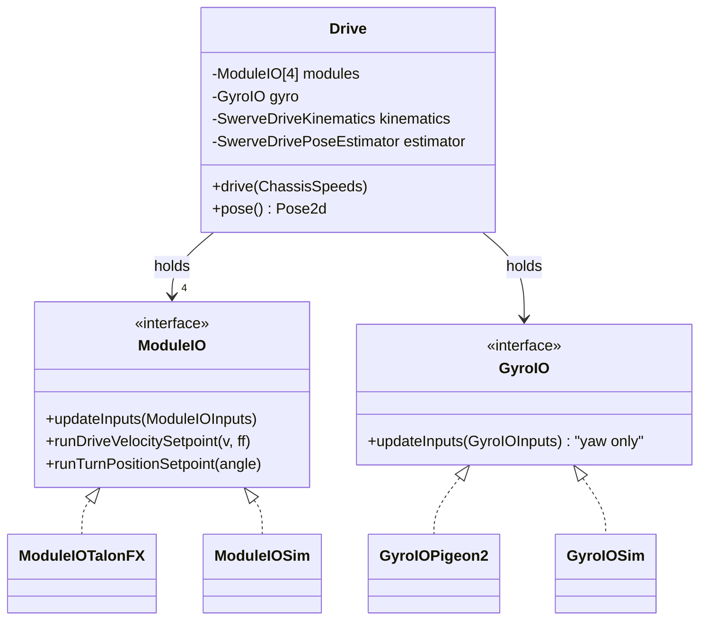

# Swerve Drivetrain — the Multi-Interface Special Case

> **Prereq:** [`00-anatomy-of-a-subsystem.md`](00-anatomy-of-a-subsystem.md) and all of
> [`01`](01-linear-position.md)–[`03`](03-velocity.md). The drivetrain is the one subsystem that
> **breaks the single-IO rule**: it is built from *two* interfaces (`ModuleIO` ×4 + `GyroIO` ×1),
> and a module is itself two control loops behind one contract. Everything else in the series is a
> warm-up for this one.
>
> *Code is quoted to study the technique, not to copy. Build the contract for **your** mechanism.*

---

## 1. What it does

A **swerve drivetrain** moves and rotates the robot freely by independently steering and driving
four corner **modules**, and it maintains the robot's **odometry** (where am I, from wheel motion +
gyro). It is the most complex subsystem on the robot, but it is the *same* IO pattern scaled up: the
`Drive` subsystem holds four `ModuleIO`s and one `GyroIO`, runs kinematics above them, and never
names a motor.

Every serious team has it (`ModuleIO`: 14 teams, `GyroIO`: 16). It's also the subsystem most often
*bought* off the shelf (YAGSL, CTRE Tuner X) — which trades the clean seam for fast bring-up (§5).

## 2. How it operates — the archetype

### 2.1 Two control problems, four times, plus kinematics
- A **module** is a velocity loop (drive wheel, archetype [`03`](03-velocity.md)) **and** a position
  loop (turn/azimuth, archetype [`02`](02-rotational-position.md)) behind **one** `ModuleIO`.
- **Kinematics** (`SwerveDriveKinematics`) lives in the `Drive` subsystem, *above* the line: it
  converts a robot-level `ChassisSpeeds` into four `SwerveModuleState`s and back. This is the one
  subsystem with real math above the IO line, and that's correct — kinematics is vendor-free
  geometry.
- **Odometry**: each module reports its drive distance + turn angle, the gyro reports yaw, and a
  `SwerveDrivePoseEstimator` fuses them into a pose (then vision corrects it — [`05`](05-vision-sensor.md)).

### 2.2 The swerve-specific detail: high-frequency odometry
Good drivetrains sample module positions and gyro yaw at **250 Hz** (not the 50 Hz robot loop) so
odometry doesn't smear during fast motion. That's why the inputs carry *arrays* —
`odometryDrivePositionsMeters[]`, `odometryTurnPositions[]`, `odometryYawPositions[]` — a batch of
timestamped samples per cycle, not a single reading.

### 2.3 Sim
Two levels: per-module `DCMotorSim` (each motor simulated independently — enough to test kinematics
and odometry), or **maple-sim** (whole-drivetrain rigid-body physics including wheel slip and
collisions — the rung where sim can *surprise* you).



## 3. The contract — `ModuleIO` + `GyroIO`

### 3.1 `ModuleIO` — drive (velocity) + turn (position) in one interface
| Method | Crosses as | Archetype |
|---|---|---|
| `runDriveVelocitySetpoint(v, ff)` | command | velocity ([`03`](03-velocity.md)) |
| `runTurnPositionSetpoint(angleRads)` | command | rotational ([`02`](02-rotational-position.md)) |
| `runDriveVolts` / `runCharacterization` | command | open-loop / sysid |
| `setDrivePID` / `setTurnPID` | config | on-motor loops |
| `updateInputs(inputs)` | input | positions, velocities, **odometry sample arrays** |

### 3.2 `GyroIO` — the second, tiny interface
A heading sensor is *not* a module, so it gets its own interface. It is the smallest IO in the
codebase — yaw and odometry yaw samples, no actuation (like vision, [`05`](05-vision-sensor.md), the
gyro is sensor-only).

### 3.3 What they omit
No `TalonFX`/`Pigeon2`/`CANcoder` type, no kinematics (that's the subsystem), no field/auto logic.

## 4. Real implementations from the corpus

The 6328 AdvantageKit drive (the most-forked swerve base in FRC) is the reference.

### 4.1 `ModuleIO` — one module, two loops, odometry arrays
*6328 Mechanical Advantage — `RobotCode2024Public/.../subsystems/drive/ModuleIO.java`*
```java
public interface ModuleIO {
  @AutoLog class ModuleIOInputs {
    public double drivePositionRads, driveVelocityRadsPerSec, driveAppliedVolts;
    public Rotation2d turnAbsolutePosition, turnPosition;          // azimuth (rotational)
    public double turnVelocityRadsPerSec;
    public double[] odometryDrivePositionsMeters = new double[] {}; // ◀ 250 Hz batches
    public Rotation2d[] odometryTurnPositions = new Rotation2d[] {};
  }
  default void updateInputs(ModuleIOInputs inputs) {}
  default void runDriveVelocitySetpoint(double velocityRadsPerSec, double feedForward) {} // velocity loop
  default void runTurnPositionSetpoint(double angleRads) {}                                // position loop
  default void setDrivePID(double kP, double kI, double kD) {}
  default void setTurnPID(double kP, double kI, double kD) {}
  default void setDriveBrakeMode(boolean enable) {}
  default void stop() {}
}
```

### 4.2 `GyroIO` — sensor-only, three fields
*6328 Mechanical Advantage — `RobotCode2024Public/.../subsystems/drive/GyroIO.java`*
```java
public interface GyroIO {
  @AutoLog class GyroIOInputs {
    public boolean connected = false;
    public Rotation2d yawPosition = new Rotation2d();
    public Rotation2d[] odometryYawPositions = new Rotation2d[] {};
    public double yawVelocityRadPerSec = 0.0;
  }
  default void updateInputs(GyroIOInputs inputs) {}
}
```
`ModuleIOTalonFX`/`GyroIOPigeon2` are the device impls (vendor confined); `ModuleIOSim`/`GyroIOSim`
wrap `DCMotorSim`s (or maple-sim).

### 4.3 The subsystem — dependency-injected IO layer
The `Drive` subsystem takes its IOs by constructor — the cleanest expression of the seam. From
SciBorgs' test setup (which *is* the construction):
```java
drive = new Drive(gyro, frontLeft, frontRight, rearLeft, rearRight);  // 1 GyroIO + 4 ModuleIO
```
`Drive` owns the `SwerveDriveKinematics`, the `SwerveDrivePoseEstimator`, and the 250 Hz odometry
thread; it converts `ChassisSpeeds` to module setpoints and reads odometry back — all above five IO
seams, none of which name a vendor.

## 5. Variations across teams

| Variation | Team / tool | How it differs | Note |
|---|---|---|---|
| Hand-rolled AdvantageKit | 6328, 254, 2706 | per-module IO + gyro IO, the contract above | the clean seam; most portable |
| **maple-sim** physics | 3647, 1114 | `ModuleIOSim` backed by whole-drivetrain dynamics, not 4 independent motors | sim that surprises you |
| YAGSL (off-the-shelf) | 2877, 4915 | a configured swerve library; you don't write `ModuleIO` | fast bring-up, the seam is YAGSL's |
| CTRE Tuner X generated | many | `TunerConstants` + CTRE's `SwerveDrivetrain` API used directly | **breaks the seam** — see §6.3 |
| 250 Hz odometry thread | 6328, 254 | a separate thread samples module/gyro positions; the arrays in §4.1 | the high-frequency detail |
| Published as a library | 3061 (`3061-lib`) | the whole drivetrain is a versioned, reusable swerve package | the library test, passed (§6.2) |

## 6. The governing ethic, applied to the drivetrain

### 6.1 Mock below, test above — five mocks, real odometry
The swerve test is the richest mock-below example in the corpus: construct `Drive` from **four
`SimModule`s and a `NoGyro`**, command velocities, and assert both the chassis speeds *and the
odometry pose*:

*1155 SciBorgs — `Reefscape-2025/src/test/java/.../robot/SwerveTest.java`*
```java
@BeforeEach public void setup() {
  setupTests();
  drive = new Drive(new NoGyro(),
                    new SimModule("FL"), new SimModule("FR"),
                    new SimModule("RL"), new SimModule("RR"));   // ◀ 5 IO mocks
}

@RepeatedTest(5) public void reachesRobotVelocity() {
  double vx = rand(), vy = rand();
  run(drive.drive(() -> vx, () -> vy, () -> Rotation2d.kZero, () -> 0));
  fastForward(500);
  ChassisSpeeds s = drive.fieldRelativeChassisSpeeds();
  assertEquals(vx, s.vxMetersPerSecond, DELTA);                 // kinematics correct
  assertEquals(vy, s.vyMetersPerSecond, DELTA);
}

@RepeatedTest(5) public void testModuleDistance() {
  // command a field-relative velocity for deltaT seconds...
  run(c); fastForward(Seconds.of(deltaT));
  Pose2d pose = drive.pose();
  assertEquals(deltaX, pose.getX(), DELTA * 4);                 // odometry integrates correctly
  assertEquals(deltaY, pose.getY(), DELTA * 4);
}
```
This single test exercises kinematics *and* odometry with no hardware — `reachesRobotVelocity`
checks the `ChassisSpeeds`↔module-state math; `testModuleDistance` drives for a fixed time and
asserts the pose moved the integrated distance. (SciBorgs leaves `systemCheck` and the
align-to-pose test `@Disabled` — honest about which parts the sim is tuned for.) It only works
because `Drive` takes its five IOs by constructor; swap in real `ModuleIOTalonFX`/`GyroIOPigeon2`
and the same `Drive` runs the robot.

### 6.2 Rip it out as a library
The drivetrain is the subsystem teams most successfully extract — `3061-lib`, YAGSL, and CTRE's
generator are all "swerve as a dependency." The `drive/` package needs WPILib geometry/kinematics +
its two IO interfaces; its only outward coupling is feeding pose to `RobotState` (or owning the
estimator itself). It must not import `Arm`, `Intake`, or `Superstructure`. That it's the most
commonly-published-as-a-library subsystem is the proof the seam holds when you keep kinematics
vendor-free and the motors behind `ModuleIO`.

### 6.3 Vendor discipline — and the honest exception
> **Banned above the line:** `com.ctre.*`, `com.revrobotics.*`, the Pigeon/NavX SDK. They live in
> `ModuleIOTalonFX` / `GyroIOPigeon2` only. Allowed above: WPILib `kinematics`, `geometry`,
> `SwerveDrivePoseEstimator`.

The honest exception: **CTRE's Tuner X generator** produces a `SwerveDrivetrain` you call directly,
and **YAGSL** is a swerve library with its own internal seam — both put a vendor/library type above
*your* IO line. That's a real, deliberate trade: you give up the clean `ModuleIO` seam (and the
simple sim/test above) in exchange for a configured drivetrain in an afternoon. If you take it, keep
the generated drivetrain behind your *own* thin `DriveIO`-style wrapper so the rest of the robot
still doesn't import `com.ctre` — otherwise a swerve-vendor change becomes a robot-wide refactor.
Teams that hand-roll `ModuleIO` (6328, 254) keep the seam; teams that generate trade it away
knowingly.

## 7. Checklist — is your drivetrain intact?

- [ ] A `ModuleIO` carrying both `runDriveVelocitySetpoint` (velocity) and `runTurnPositionSetpoint`
      (position), plus **odometry sample arrays** for high-frequency integration.
- [ ] A separate, sensor-only `GyroIO` (yaw + odometry yaw).
- [ ] `Drive` takes its 4 modules + gyro **by constructor**; kinematics + pose estimator live in the
      subsystem, vendor-free.
- [ ] `ModuleIOTalonFX`/`GyroIOPigeon2` are the only files importing the motor/gyro SDK.
- [ ] A test builds `Drive` from 4 sim modules + a no-op gyro and asserts chassis speeds *and*
      odometry pose.
- [ ] If you generate the drivetrain (Tuner X / YAGSL), it's wrapped behind your own IO so
      `com.ctre` stays out of the rest of the robot.
- [ ] (Stretch) `ModuleIOSim` uses maple-sim for whole-drivetrain physics, not 4 independent motors.
