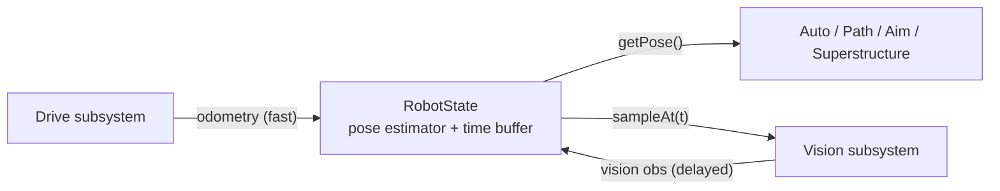

# RobotState — the State Seam (the robot's world model)

> **Prereq:** [`00-anatomy-of-a-subsystem.md`](00-anatomy-of-a-subsystem.md) and
> `../elite-architecture.md` §2.4. RobotState is a "subsystem" with **no hardware** — its IO is
> *observations in, belief out*. It's the purest example of the ethic: zero vendor types, zero IO
> impls, just math — and therefore the single most testable class on the robot.
>
> *Code is quoted to study the technique, not to copy. Build the contract for **your** robot.*

---

## 1. What it does

**RobotState owns the robot's best belief about the world** — where it is on the field (pose), and
later its game-piece and mechanism state. Sensors *write* to it (the drivetrain feeds wheel
odometry; vision feeds AprilTag corrections); decisions, pathing, and auto *read* from it. It is the
**state seam**: one fused estimate that everything shares, rather than each subsystem keeping its own
guess. Centralizing it is what makes vision, pathfinding, and auto agree on "where are we" —
the difference between D7 level 2 (a pose estimate exists) and level 4 (a world model is the
architecture).

## 2. How it operates — the I/O boundary (there is no control loop)

```
Drive  → addOdometryObservation(wheelPositions, gyro, t) ┐
Vision → addVisionObservation(pose, t, stdDevs)          ├→ RobotState → getPose() / sampleAt(t)
                                                          ┘   (everyone reads)
```
Two streams come in at different rates and latencies: **odometry** is fast and continuous but drifts;
**vision** is accurate but sparse and *delayed* (a frame is timestamped in the past). RobotState
reconciles them with a **time-interpolating buffer**: it keeps ~2 s of timestamped odometry poses, so
when a delayed vision measurement arrives it can rewind to where the robot *was* at that timestamp,
blend the correction in by a Kalman gain, and replay odometry forward to now. The "IO" is purely
informational — observations in, a fused `Pose2d` out — no motor ever moves.



## 3. The contract

### 3.1 The API
| Method | Direction | Why |
|---|---|---|
| `addOdometryObservation(obs)` | in (write) | integrate wheel motion + gyro into the estimate, buffer it |
| `addVisionObservation(obs)` | in (write) | blend a timestamped AprilTag pose by its std-dev weight |
| `getPose()` / `getEstimatedPose()` | out (read) | the fused belief — what auto and aiming use |
| `sampleAt(timestamp)` | out (read) | the pose at a past instant (for latency-correcting a measurement) |
| `resetPose(pose)` | in | seed the estimate (auto start, operator reset) |

### 3.2 What it omits — everything physical
No `TalonFX`, no `PhotonCamera`, **no IO interface, no `Drive`/`Vision` object reference** — only the
*observations* those subsystems hand it (a `Pose2d`, a `SwerveModulePosition[]`, a timestamp). It
holds no commands and no game logic. It is pure `edu.wpi.first.math` geometry.

## 4. Real implementation from the corpus

6328's `RobotState` is the reference world model — a hand-rolled estimator so the team owns the
buffer (for replay) and can hang the rest of the world model off it.

### 4.1 The observations in
*6328 Mechanical Advantage — `RobotCode2025Public/.../RobotState.java`*
```java
public void addOdometryObservation(OdometryObservation obs) {
  Twist2d twist = kinematics.toTwist2d(lastWheelPositions, obs.wheelPositions());
  lastWheelPositions = obs.wheelPositions();
  odometryPose = odometryPose.exp(twist);
  obs.gyroAngle().ifPresent(g -> odometryPose =
      new Pose2d(odometryPose.getTranslation(), g.plus(gyroOffset)));   // gyro overrides integrated heading
  poseBuffer.addSample(obs.timestamp(), odometryPose);                  // ◀ the 2-second time buffer
  estimatedPose = estimatedPose.exp(lastOdometryPose.log(odometryPose));
}
```

### 4.2 The vision blend — latency-corrected, std-dev weighted
*same file*
```java
public void addVisionObservation(VisionObservation obs) {
  // skip if older than the buffer; else get the odometry pose AT the observation's timestamp
  var sample = poseBuffer.getSample(obs.timestamp());
  if (sample.isEmpty()) return;
  // build a 3x3 Kalman gain from the observation's std-devs, blend vision into the rewound estimate,
  // then replay odometry forward to now:
  Matrix<N3,N3> visionK = /* from obs.stdDevs() */;
  Transform2d correction = new Transform2d(estimateAtTime, obs.visionPose());
  estimatedPose = estimateAtTime.plus(scaledByK(correction, visionK)).plus(sampleToOdometryTransform);
}
public record VisionObservation(Pose2d visionPose, double timestamp, Matrix<N3,N1> stdDevs) {}
```
This is ~80 lines of pure `edu.wpi.first.math` — `Twist2d`, `Transform2d`, `Matrix`,
`TimeInterpolatableBuffer`. **Grep the imports and you will not find one vendor type.** That's the
point: the state seam is math, not hardware.

### 4.3 The world model grows off it
6328's `RobotState` also carries `@AutoLogOutput` game-piece observations (coral/algae), robot
velocity, and even mechanism state (`elevatorExtensionPercent`, `intakeDeployPercent`) — so "the
robot's belief about everything" lives in one inspectable place. That's the L4 world model: not just
pose, but a shared, logged model of the whole situation.

## 5. Variations across teams (the D7 ladder)

| Level | Shape | Team / tool |
|---|---|---|
| L2 | a `SwerveDrivePoseEstimator` owned *privately by Drive*; `addVisionMeasurement` called from vision | most teams |
| L3 | + std-dev / ambiguity **rejection** before fusing (see [`05-vision-sensor`](05-vision-sensor.md)) | 3061, 254 |
| L4 | a **dedicated `RobotState`** owning the estimator + time buffer, decoupled from Drive; world model (pose + game-piece + mechanism state) | 6328, 254 |

The cheap version is real: WPILib's `SwerveDrivePoseEstimator` *is* a RobotState-lite with
`addVisionMeasurement` built in. Pulling it out of Drive into its own class (so vision and auto don't
reach into the drivetrain) is the architectural move; hand-rolling it (6328) buys the replay buffer
and the room to grow the world model. Singleton (6328's `getInstance()`) vs. constructor-injected is
a style choice — injected is friendlier to tests (§6).

## 6. The governing ethic — RobotState is the easiest thing to test, and the least tested

### 6.1 Mock below, test above
There is nothing to mock — RobotState takes plain data. So the unit test is trivial to write:
```java
// the test RobotState makes possible (and most teams never write):
var state = new RobotState(kinematics);
state.resetPose(Pose2d.kZero);
// feed a straight 1 m/s drive for 1 s as odometry samples...
for (double t = 0; t < 1.0; t += 0.02) state.addOdometryObservation(odom(t));
assertEquals(1.0, state.getPose().getX(), 0.02);                 // odometry integrates
state.addVisionObservation(new VisionObservation(new Pose2d(0.9,0,kZero), 0.98, tightStdDevs));
assertTrue(state.getPose().getX() < 1.0);                        // vision pulled it back
```
No HAL, no robot, no other subsystem — just feed observations and assert the belief. The corpus
finding is the irony: this is the **most** unit-testable class on the robot (pure functions of
input), and almost nobody tests it. It's the highest-leverage test a team isn't writing.

### 6.2 Rip it out as a library
RobotState imports `edu.wpi.first.math.*` and nothing else load-bearing — it is *already* a library.
It must not import a subsystem object or a vendor type; if it does, the seam has leaked. Constructor-
inject the `SwerveDriveKinematics` (don't reach into `Drive`) and it's a standalone, reusable estimator.

### 6.3 Vendor discipline — trivially clean, and that's the lesson
> A correct `RobotState` cannot leak a vendor type **because it never touches hardware.** If you see
> `com.ctre`/`org.photonvision` in your RobotState, something is badly wrong — a subsystem is handing
> it a device handle instead of an observation. The fix: subsystems compute `Pose2d`/observations and
> pass *those*.

## 7. Checklist — is your state seam intact?

- [ ] One `RobotState` owns the pose estimate; Drive does **not** privately own the estimator.
- [ ] It takes `addOdometryObservation` + `addVisionObservation(pose, t, stdDevs)` and exposes
      `getPose()` / `sampleAt(t)`.
- [ ] A `TimeInterpolatableBuffer` reconciles delayed vision against past odometry.
- [ ] Its imports are WPILib math/geometry (+ logging) only — **no vendor, no IO impl, no subsystem
      object**.
- [ ] Vision feeds it (and only it); auto/aim read pose *from* it, never from Drive.
- [ ] A unit test feeds odometry + a vision observation and asserts the fused pose — the easy test
      almost no one writes.
