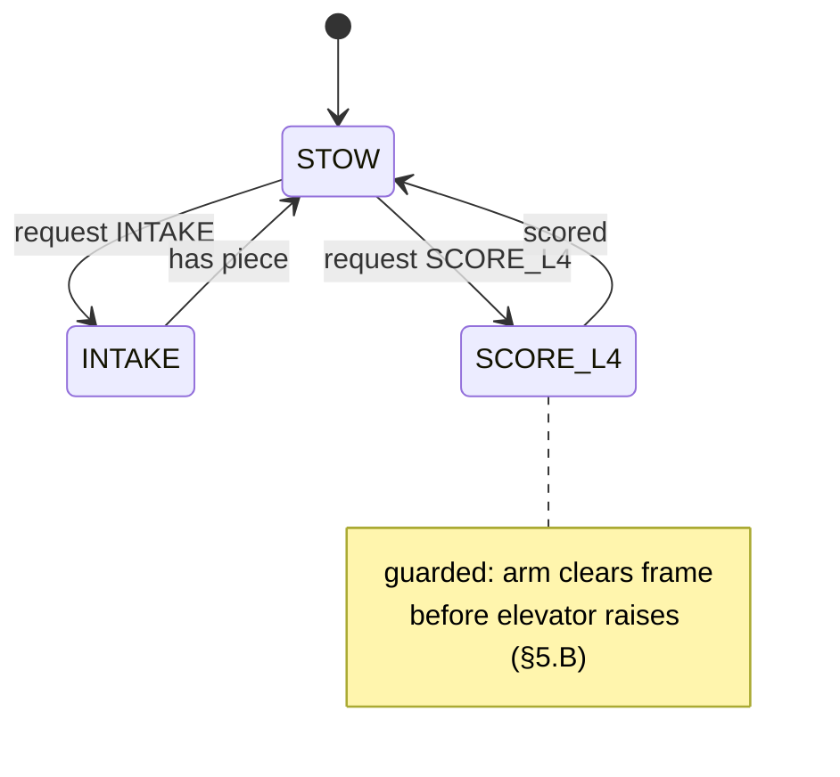

# Superstructure — the Coordination Seam (intent → execution)

> **Prereq:** [`00-anatomy-of-a-subsystem.md`](00-anatomy-of-a-subsystem.md) and
> `../elite-architecture.md` §2.5 + §5.B. Like [`07-robotstate`](07-robotstate.md), the
> Superstructure is a "subsystem" with **no hardware** — its IO is *goals in, subsystem setpoints
> out*. It imports the subsystems' public state API, **never their IO impls and never a vendor type**.
>
> *Code is quoted to study the technique, not to copy. Build the contract for **your** robot.*

---

## 1. What it does

The **Superstructure turns one robot-wide goal into a coordinated set of subsystem setpoints**,
through a single transition function that is allowed to *reorder or reject* a transition for safety.
A button asks for `SCORE_L4`; the Superstructure decides the legal sequence — clear the frame, raise
the elevator, then score — that realizes it. It is the **coordination seam**: the one object that
sees every mechanism at once, so the knowledge that "the arm must clear before the elevator rises"
lives in exactly one place instead of scattered across subsystems.

This is the richest point of architectural divergence in FRC (rubric D2). The corpus shows
`Superstructure` in 22 teams and a generic `*StateMachine` in 12 — but a class *named* Superstructure
is not automatically one (§5).

## 2. How it operates — the I/O boundary (intent vs execution)

```
Operator/Auto → requestGoal(Goal) → [ one guarded transition function ] → subsystem.setState(...) ×N
                                          reads RobotState for safety/sequencing
```
The split is **intent vs execution**: a caller expresses *what it wants* (a goal) and walks away; the
Superstructure owns *how each mechanism gets there* (the legal, sequenced setpoints). Callers cannot
drive a mechanism into an illegal configuration because only the transition function writes setpoints.
There is no control loop here — each subsystem still closes its own loop (its IO); the Superstructure
only decides *which setpoint each subsystem should have right now*.



## 3. The contract

### 3.1 The API
| Method | Direction | Why |
|---|---|---|
| `requestGoal(Goal)` / `setStateCommand(State)` | in | a caller asks for one robot-wide state; returns a `Command` |
| the transition function (`applyGoal`/`updateSubsystemStates`) | internal | **the seam** — fans the goal out to subsystem setpoints, with guards |
| `getState()` / `atGoal()` | out | what the robot is doing now (read by auto, LEDs, RobotState) |

### 3.2 What it omits
No `TalonFX`, no `*IO` interface, **no `XxxIOSim`/`XxxIOReal`** — it holds the *subsystems* (their
public `setState`/`setGoal` API), not their hardware. No motor math, no vendor SDK. Pure command +
decision logic.

## 4. Real implementations from the corpus

### 4.1 Centralized FSM — one goal fans out to dumb subsystems (the 581/3128 pattern)
A single object holds the whole robot's state machine and drives deliberately "dumb" subsystems that
only expose state setters. The goal is a `RobotStates` enum where **each robot state bundles a target
state for every subsystem**:

*3128 Aluminum Narwhals — `3128-robot-2025/.../subsystems/Robot/RobotManager.java`*
```java
public class RobotManager extends FSMSubsystemBase<RobotStates> {
  private static Elevator elevator; private static Manipulator manipulator;
  private static Intake intake;     private static Climber climber;  private static Swerve swerve;

  // THE SEAM: one robot goal -> a sequenced, guarded fan-out to each subsystem
  public Command updateSubsystemStates(RobotStates nextState) {
    return sequence(
      elevator.setStateCommand(nextState.getElevatorState())
              .unless(() -> nextState.getElevatorState() == ElevatorStates.UNDEFINED),
      manipulator.setStateCommand(nextState.getManipulatorState()).unless(/* ... */),
      intake.setStateCommand(nextState.getIntakeState()).unless(/* ... */),
      climber.setStateCommand(nextState.getClimberState()).unless(/* ... */),
      waitUntil(() -> climber.winch.atSetpoint())                    // ◀ a guarded transition
              .unless(() -> nextState.getClimberState() == ClimberStates.UNDEFINED));
  }
}
```
Every transition routes through `updateSubsystemStates`. The `waitUntil(...)` is the interlock seam
(§5.B): you sequence the *safe order* here, and the subsystems stay dumb. Note the imports — WPILib
commands, the team's own subsystems and `common` FSM lib, and **not one vendor type**.

### 4.2 Superstructure-as-SubsystemBase with a state machine (the 3476 style)
A `Superstructure` subsystem holds the mechanisms + a `SuperstructureStateMachine`, accepts a target
state, and runs the transition *over time* in `periodic()`:

*3476 Code Orange — `Godzilla-ReefScapeOffseason/.../superstructure/Superstructure.java`*
```java
public class Superstructure extends SubsystemBase {
  private Elevator elevator; private EndEffector endEffector;
  private SuperstructureStateMachine stateMachine;

  @Override public void periodic() {
    stateMachine.continueTransition();                        // advance the guarded transition
    RobotState.setSuperstructureState(getCurrentState());     // publish intent to the world model
    Logger.recordOutput("Superstructure/TargetState", stateMachine.getTargetState());
  }
  public Command setStateCommand(SuperstructureState state, String name) {
    return new InstantCommand(() -> stateMachine.setTargetState(state)).withName(name);
  }
}
```
Here the goal request is just "set the target state"; `continueTransition()` walks the legal path each
cycle. It writes its intent to [`RobotState`](07-robotstate.md) so the rest of the robot can read what
the superstructure is doing.

## 5. Variations across teams (the D2 ladder)

| Level | Shape | Team |
|---|---|---|
| 1 | command composition — sequential/parallel groups; no coordinator | most teams |
| 2 | **wanted/current** FSM, distributed (one per subsystem + a top one) | 2910, 4099 |
| 2 | **centralized** `RobotManager` — one FSM, dumb subsystems | 581, 3128 |
| 3 | `Superstructure` coordinator that separates intent from execution + handles kinematic safety | 254, 3476, 6328 |
| 4 | **state graph** — transitions are data; pathfind through legal states (JGraphT / A*) | 6328, 254 |

**The anti-pattern to avoid.** A class named `Superstructure` is not a coordinator if it just holds
references and exposes manual jogs — the rubric's "level-1 wearing a level-3 name":

*5190 Green Hope Falcons — `2025CompetitionSeason/.../Superstructure.java` (what NOT to ship)*
```java
public class Superstructure {
  public final Pivot pivot_;  public final EndEffector end_effector_;
  public Command jogPivot(double percent) { /* StartEndCommand setPercent */ }   // no goal, no transition
}
```
There's no goal enum, no transition function, no interlock — it's a bag of subsystems with jog
buttons. Check for an actual goal-request API and a single transition function before scoring D2 ≥ 3.

## 6. The governing ethic, applied to the coordination seam

### 6.1 Mock below, test above — assert the *safe sequence*
The Superstructure is the one place an interlock lives, and interlocks are exactly what you want to
test. Because the subsystems below it run on their `*IOSim`, you construct the whole thing in sim,
request a goal, and assert the **order**:
```java
// construct subsystems on Sim, build the superstructure, request a dangerous goal:
var sup = new Superstructure(Elevator.create(), Arm.create() /* both Sim in a test */);
run(sup.requestGoal(SCORE_L4));
fastForward();
// assert the guard held: the arm cleared the frame BEFORE the elevator passed the danger zone
assertTrue(armClearedBeforeElevatorRose);   // the interlock, verified without a robot
```
This is the test that catches the failure mode that *breaks robots* — two mechanisms colliding — and
it costs nothing once the subsystems have Sim impls. See [`testing.md`](../testing.md) for the harness.

### 6.2 Rip it out as a library
The Superstructure depends on WPILib commands + the **subsystems' public API** (and `RobotState`). It
must not import a `*IO` impl or a vendor type, and ideally takes its subsystems by constructor (3476,
5190) rather than `getInstance()` (3128) so a test can inject sim-backed ones. Its only coupling is to
mechanisms it coordinates — which is correct; that's its whole job.

### 6.3 Vendor & IO discipline
> The Superstructure imports **subsystems, not their hardware.** No `com.ctre`/`com.revrobotics`, no
> `ElevatorIOTalonFX`, no `ElevatorIO`. If a vendor type or an IO impl appears here, a subsystem has
> leaked its hardware upward — the fix is to expose a `setGoal(...)`/`setState(...)` on the subsystem
> and call that.

The corpus exemplars above are clean (3128, 3476 import zero vendor types) — the coordination seam is,
like RobotState, naturally vendor-free, and a leak here is a loud signal that a subsystem's
abstraction is broken.

## 7. Checklist — is your coordination seam intact?

- [ ] A goal/state enum and a `requestGoal`/`setStateCommand` API — not just per-subsystem jog buttons.
- [ ] **One** transition function fans the goal out to subsystem setpoints; all transitions route through it.
- [ ] Kinematic interlocks (mechanism-collision safety) live **here**, as guards/sequencing — not in subsystems.
- [ ] It holds subsystems (their `setState` API), **no `*IO` impl and no vendor type**.
- [ ] Subsystems are injected by constructor so a test can pass sim-backed ones.
- [ ] A test requests a dangerous goal and asserts the safe ordering held (the interlock).
- [ ] Intent is logged / written to [`RobotState`](07-robotstate.md) so auto, LEDs, and dashboards can read it.
